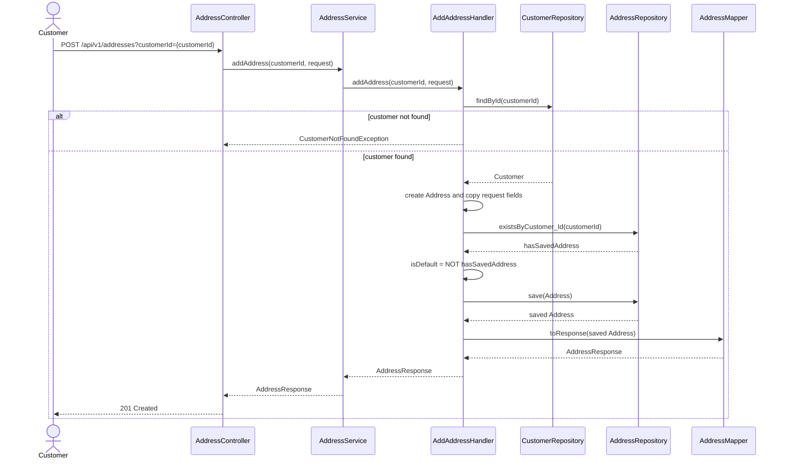
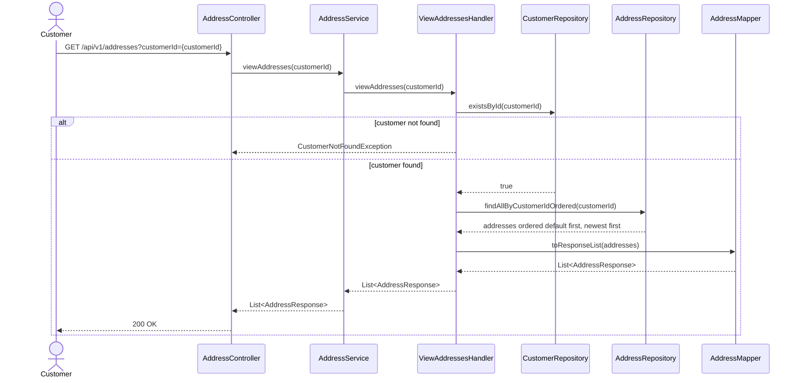
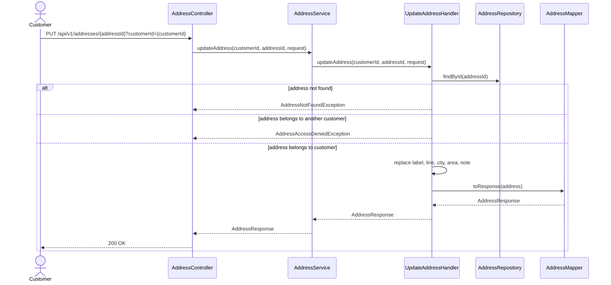
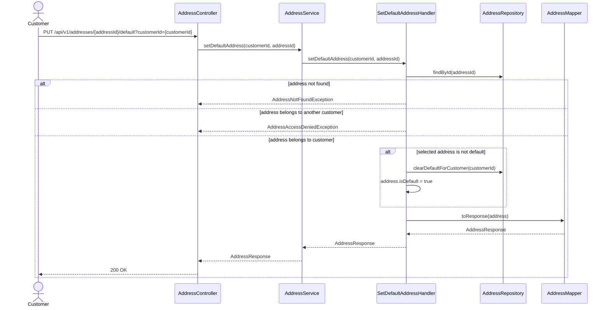
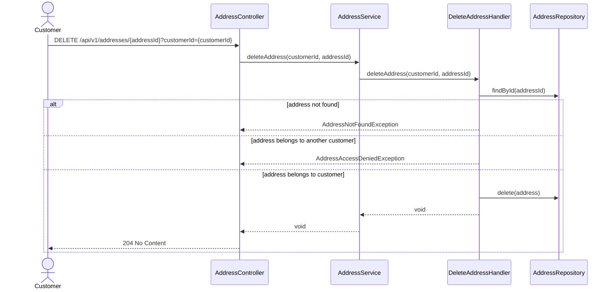

# Address Management Sequence Diagrams

Related documents: [Use case](./use-case.md) and [Pseudocode](./pseudocode.md).

## Add Address

## View Addresses

## Update Address

## Set Default Address

## Delete Address

