# ERD

Data model for Foodie.

**The Flyway migrations in
[`src/main/resources/db/migration/`](../../src/main/resources/db/migration/) are the source of
truth.** The diagram below is a rendering of them as of `V13__create_payment_methods.sql`. It is
not generated: **every migration that changes the schema must update this diagram in the same
PR.** When the two disagree, the migrations win and this file is the bug.

## Diagram

Keys: `PK` primary key, `FK` foreign key, `UK` unique constraint. Every primary key is
`BIGINT GENERATED BY DEFAULT AS IDENTITY`. Cardinality is what the schema enforces, not what the
application happens to do: an order with no lines is legal to the database, so it is drawn as
zero-or-more.

```mermaid
erDiagram
    users {
        BIGINT user_id PK
        VARCHAR(150) user_name "NOT NULL"
        VARCHAR(255) user_email "NOT NULL; unique on lower(email) among active users"
        VARCHAR(255) user_password "NOT NULL; BCrypt hash"
        VARCHAR(20) user_phone
        DATE user_date_of_birth
        VARCHAR(20) user_gender
        TIMESTAMPTZ user_deleted_at "soft delete; NULL = active"
    }

    customers {
        BIGINT customer_id PK
        BIGINT user_id FK, UK "NOT NULL"
    }

    restaurants {
        BIGINT restaurant_id PK
        BIGINT user_id FK, UK "NOT NULL"
        VARCHAR(255) restaurant_name "NOT NULL"
        TEXT restaurant_description
        BOOLEAN restaurant_is_open "NOT NULL; default TRUE"
    }

    menus {
        BIGINT menu_id PK
        BIGINT restaurant_id FK "NOT NULL"
        VARCHAR(100) menu_code UK "NOT NULL"
        VARCHAR(100) menu_category "NOT NULL"
    }

    menu_items {
        BIGINT menu_item_id PK
        BIGINT menu_id FK "NOT NULL"
        VARCHAR(100) menu_item_code UK "NOT NULL"
        VARCHAR(150) menu_item_name "NOT NULL"
        TEXT menu_item_image_url
        NUMERIC menu_item_price "NUMERIC(12,2) NOT NULL; >= 0"
        INTEGER menu_item_stock "NOT NULL"
        VARCHAR(255) menu_item_note
    }

    carts {
        BIGINT cart_id PK
        BIGINT customer_id FK, UK "NOT NULL"
    }

    cart_items {
        BIGINT cart_item_id PK
        BIGINT cart_id FK, UK "NOT NULL; UK is (cart_id, menu_item_id)"
        BIGINT menu_item_id FK, UK "NOT NULL"
        INTEGER cart_item_quantity "NOT NULL; > 0"
        NUMERIC cart_item_price "NUMERIC(12,2) NOT NULL; >= 0"
        VARCHAR(255) cart_item_note
    }

    addresses {
        BIGINT address_id PK
        BIGINT customer_id FK "NOT NULL"
        VARCHAR(100) address_label "NOT NULL"
        VARCHAR(255) address_line "NOT NULL"
        VARCHAR(100) address_city "NOT NULL"
        VARCHAR(100) address_area "NOT NULL"
        TEXT address_note
        BOOLEAN address_is_default "NOT NULL; default FALSE; one TRUE per customer"
        TIMESTAMPTZ address_created_at "NOT NULL; default now"
    }

    payment_methods {
        BIGINT payment_method_id PK
        BIGINT customer_id FK "NOT NULL"
        VARCHAR(20) payment_method_brand "NOT NULL; CardBrand enum"
        CHAR(4) payment_method_last4 "NOT NULL"
        SMALLINT payment_method_expiry_month "NOT NULL; 1..12"
        SMALLINT payment_method_expiry_year "NOT NULL"
        VARCHAR(150) payment_method_holder_name "NOT NULL"
        BOOLEAN payment_method_is_default "NOT NULL; default FALSE; one TRUE per customer"
        TIMESTAMPTZ payment_method_created_at "NOT NULL; default now"
    }

    orders {
        BIGINT order_id PK
        BIGINT customer_id FK "NOT NULL"
        BIGINT restaurant_id FK "NOT NULL; denormalised from the lines"
        VARCHAR(32) order_status "NOT NULL; vocabulary enforced in Java"
        NUMERIC order_total "NUMERIC(12,2) NOT NULL; >= 0"
        TIMESTAMPTZ order_created_at "NOT NULL"
        INTEGER order_prep_time_minutes "> 0; set on accept"
        VARCHAR(32) order_rejection_reason "set on reject"
        VARCHAR(255) order_rejection_note
    }

    order_items {
        BIGINT order_item_id PK
        BIGINT order_id FK "NOT NULL"
        BIGINT menu_item_id FK "NOT NULL"
        VARCHAR(150) order_item_name "NOT NULL; snapshot"
        INTEGER order_item_quantity "NOT NULL; > 0"
        NUMERIC order_item_price "NUMERIC(12,2) NOT NULL; >= 0; snapshot"
        VARCHAR(255) order_item_note
    }

    order_status_history {
        BIGINT order_status_history_id PK
        BIGINT order_id FK "NOT NULL"
        VARCHAR(32) order_status_history_from "NOT NULL"
        VARCHAR(32) order_status_history_to "NOT NULL"
        VARCHAR(32) order_status_history_actor_role "NOT NULL; includes SYSTEM"
        TIMESTAMPTZ order_status_history_at "NOT NULL"
    }

    order_ratings {
        BIGINT order_rating_id PK
        BIGINT order_id FK, UK "NOT NULL"
        INTEGER order_rating_score "NOT NULL; 1..5"
        VARCHAR(1000) order_rating_comment
        TIMESTAMPTZ order_rating_created_at "NOT NULL"
    }

    users ||--o| customers : "is a"
    users ||--o| restaurants : "is a"
    restaurants ||--o{ menus : has
    menus ||--o{ menu_items : lists
    customers ||--o| carts : owns
    carts ||--o{ cart_items : holds
    menu_items ||--o{ cart_items : "added as"
    customers ||--o{ addresses : saves
    customers ||--o{ payment_methods : saves
    customers ||--o{ orders : places
    restaurants ||--o{ orders : receives
    orders ||--o{ order_items : contains
    menu_items ||--o{ order_items : "ordered as"
    orders ||--o{ order_status_history : "transitions through"
    orders ||--o| order_ratings : "rated by"
```

## Constraints the diagram cannot show

1. **Partial unique indexes.** `uq_users_active_email` on `lower(user_email) WHERE user_deleted_at
   IS NULL` (V12 dropped V1's plain `UNIQUE`), `uq_addresses_one_default_per_customer` (V8) and
   `uq_payment_methods_one_default_per_customer` (V13) on `customer_id WHERE ..._is_default`.
2. **`ON DELETE CASCADE`** on every foreign key except the three into a catalogue row:
   `cart_items.menu_item_id`, `order_items.menu_item_id` and `orders.restaurant_id`. Deleting a
   user cascades through its customer to the cart, addresses, payment methods and orders. Users are
   soft-deleted (`user_deleted_at`), so in practice the cascade is only exercised by test cleanup.
3. **Secondary indexes:** every foreign key column is indexed, plus
   `idx_orders_customer_created` on `(customer_id, order_created_at DESC, order_id DESC)` for the
   order-history keyset pagination (V9).
4. **`CHECK` constraints** are noted in the column comments (`>= 0`, `> 0`, `1..12`, `1..5`).

## Original design

The first version of the model, drawn in DrawIO before any migration existed:
[`../erd/Food Delivery.pdf`](<../erd/Food Delivery.pdf>). It is kept for history and is **out of
date** — use the Mermaid diagram above. (This page used to embed `./images/erd.drawio.png`, which
was never committed.)
