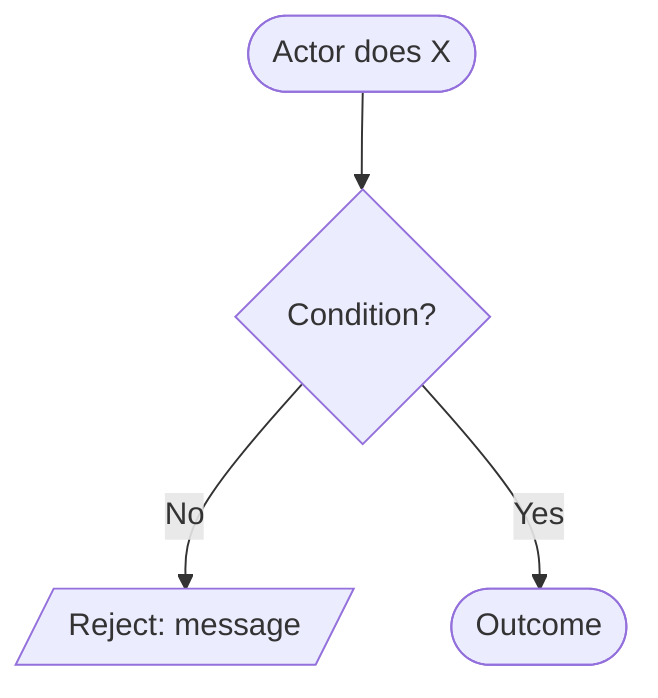

<!--
Copy this file into `use-cases/<area>/<use-case>/<use-case>.md`.

Rules:
- Folder name, file name and the Goal heading all describe the same use case, in kebab-case.
- One use case per folder. Diagrams go inline as Mermaid; binary exports go in `images/`.
- Delete any section that genuinely does not apply, rather than leaving it empty.
- `implementation-plan.md` may sit beside this file — it is gitignored working notes,
  not part of the spec. Anything worth keeping belongs here.
- The spec is the source of truth. When code and spec disagree, fix the spec in the same PR.
- The `../../../` links below resolve from `use-cases/<area>/<use-case>/`, where the copy
  lands — they are deliberately broken while sitting here in `use-cases/`.
-->

# Goal

One sentence. What the actor achieves, in the language of the [glossary](../../../glossary.md).

## Actor

Who triggers this — one of the roles in [actors](../../../actors/actors.md).

## Preconditions

What must already be true before the flow can start. Numbered.

1.
2.

## Business Rules

The invariants this use case enforces, independent of any one step. Numbered, because the
Exception Flows below refer back to them.

1.
2.

## Main Success Scenario

The happy path, one numbered step per interaction. Start with the actor's action, end with
the system's outcome.

1. Actor …
2. System verifies …
3. System …

## Exception Flows

Each branch is labelled by the Main Flow step it extends — `2a.` extends step 2.
Every rejection names the message the caller sees.

- **2a. <condition>:** reject — "<message>".
- **3a. <condition>:** reject — "<message>".

## Postconditions

What is true once the flow succeeds.

1.
2.

## Data Model

Tables and columns this use case adds or depends on, and the migration that introduces them.

| Table | Column | Purpose |
| --- | --- | --- |
|  |  |  |

Note anything deliberately *not* stored, and why.

## Diagram

### Flowchart



### Sequence Diagram

```mermaid
sequenceDiagram
    actor Actor
    participant C as Controller
    participant S as Service
    participant R as Repository

    Actor->>C: VERB /api/v1/…
    C->>S: handle(...)
    S->>R: query(...)
    R-->>S: result
    S-->>C: response
    C-->>Actor: 200 OK
```

# Notes

Decisions, scope boundaries and things deliberately left open. Numbered.

1.
