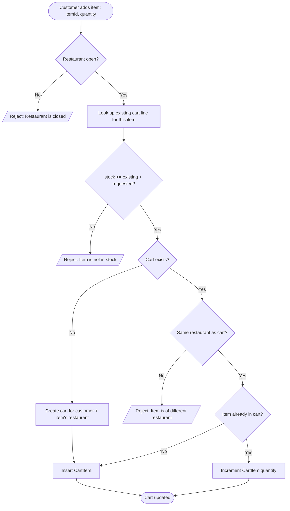
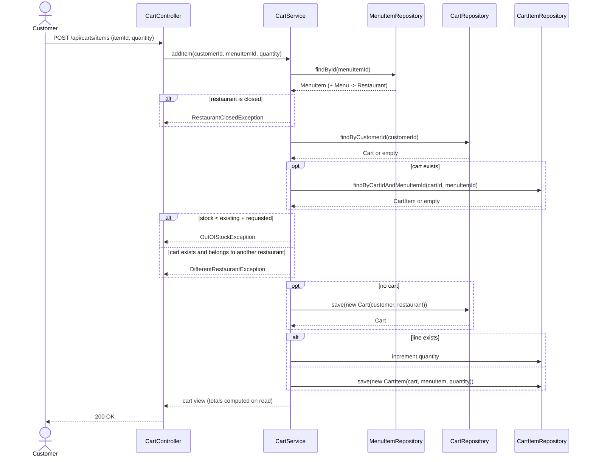

# Goal

Add an item to the customer's cart.

## Actor

Customer

## Preconditions

1. Customer is logged in / registered.
2. Restaurant exists.
3. Item exists.

## Business Rules

1. A `CartItem` is unique by **item**. Adding an item already in the cart increments the
   existing line rather than inserting a new one.
2. A cart holds items from a **single restaurant** at a time.

## Main Success Scenario

1. Customer adds an item to the cart (with quantity).
2. System verifies the restaurant is open.
3. System verifies the item has stock for the **resulting** quantity — the quantity already
   in the cart for that item plus the requested quantity.
4. System verifies the cart is empty OR the item is from the same restaurant as the cart.
5. If no cart exists, System creates one for the customer and the item's restaurant.
6. System inserts or increments the `CartItem`.

## Exception Flows

Each branch is labelled by the Main Flow step it extends.

- **1a. Item already in cart:** increment the `CartItem` quantity instead of inserting a new
  line; still enforce stock (step 3) against the resulting quantity.
- **2a. Restaurant is closed:** reject — "Restaurant is closed".
- **3a. Item is out of stock:** reject — "Item is not in stock".
- **4a. Item is from a different restaurant:** reject — "Item is of different restaurant";
  prompt the customer to clear the cart or continue with the current restaurant.

## Postconditions

1. `Cart` exists (created if it didn't), bound to exactly one restaurant.
2. `CartItem` is present in `Cart` (inserted or incremented).

## Totals

Totals are **not stored**. `Cart` carries no total column and `CartItem` carries no price
snapshot; a cart's total is computed when the cart is read, as the sum of
`quantity * MenuItem.itemPrice` over its lines.

Consequence: a cart always reflects current menu prices. If a restaurant changes a price,
open carts reprice silently. Accepted for now — capturing a price at add-time is a
checkout-time concern.

## Data Model

This use-case relies on three fields added alongside it:

| Table | Column | Purpose |
| --- | --- | --- |
| `restaurants` | `is_open` (boolean, not null) | Step 2 — open/closed check. A flag, not opening hours. |
| `menu_items` | `stock_quantity` (integer, not null) | Step 3 — stock check. |
| `carts` | `restaurant_id` (fk, not null) | Rule 2 — the cart's restaurant, stored rather than derived through `CartItem -> MenuItem -> Menu -> Restaurant`. |

## Diagram

### Flowchart

### Sequence Diagram

### Pseudocode

1. [Pseudocode](images/pseduocode.txt)

# Notes

1. Should we split this use-case into `increment-cart-item` / `decrement-cart-item`?
2. **Options are out of scope.** Uniqueness is by item alone. If item options are ever
   modelled, Rule 1 widens to (item + options) and flow 1a's match key widens with it.
3. **`is_open` is a flag, not a schedule.** Real opening hours (open/close times, timezone,
   per-day overrides) are a separate use-case.
4. **One cart per customer.** `carts.customer_id` is unique, so a customer has at most one
   cart row ever. That is fine here, but checkout must decide: either empty and reuse the
   row, or give `Cart` a status and drop the unique constraint. Deliberately left open.
