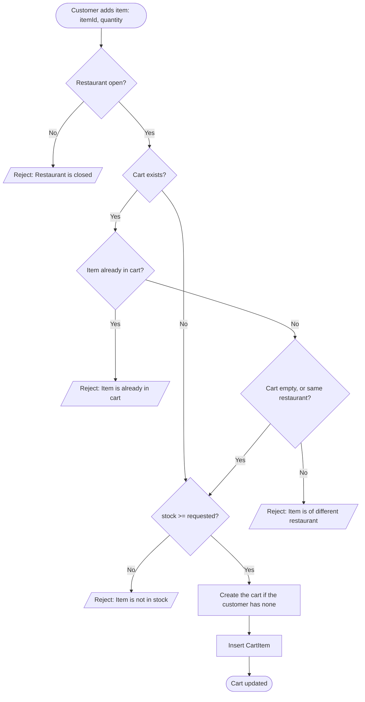
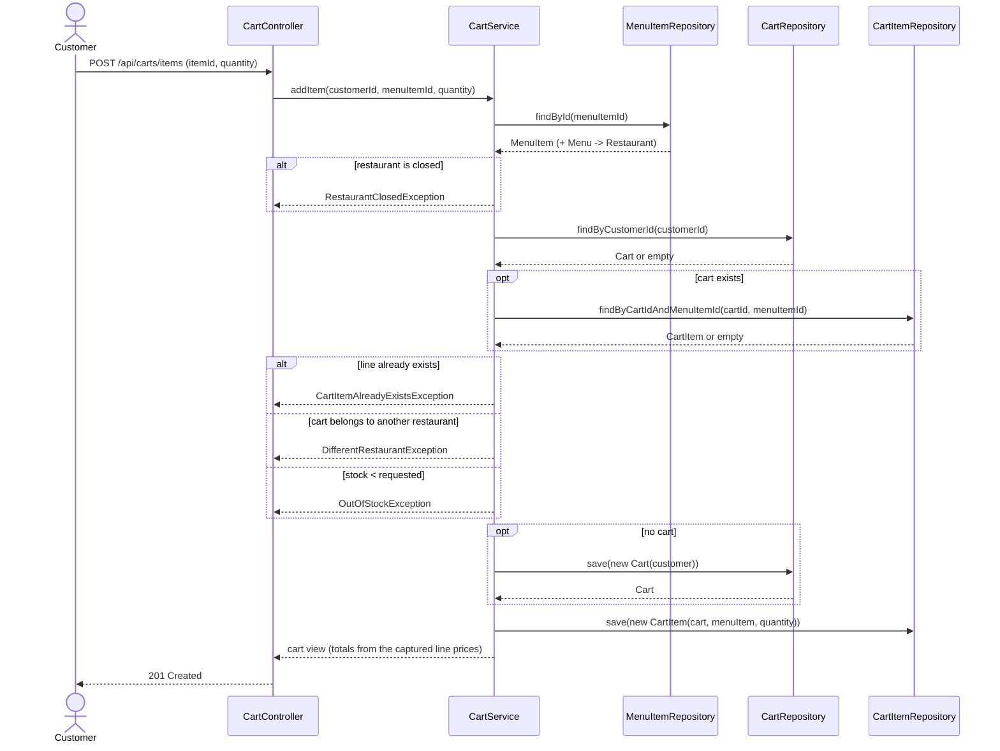

# Goal

Add an item to the customer's cart.

## Actor

Customer

## Preconditions

1. Customer is logged in / registered.
2. Restaurant exists.
3. Item exists.

## Business Rules

1. A `CartItem` is unique by **item**. Adding an item the cart already holds is rejected;
   changing the quantity of an existing line belongs to modify-cart.
2. A cart holds items from a **single restaurant** at a time.

## Main Success Scenario

1. Customer adds an item to the cart (with quantity).
2. System verifies the restaurant is open.
3. System verifies the item is not already in the cart.
4. System verifies the item has stock for the requested quantity.
5. System verifies the cart is empty OR the item is from the same restaurant as the cart.
6. If no cart exists, System creates one for the customer.
7. System inserts the `CartItem`.

## Exception Flows

Each branch is labelled by the Main Flow step it extends.

- **2a. Restaurant is closed:** reject — "Restaurant is closed".
- **3a. Item already in cart:** reject — "Item is already in cart"; the customer changes the
  quantity through modify-cart instead.
- **4a. Item is out of stock:** reject — "Item is not in stock".
- **5a. Item is from a different restaurant:** reject — "Item is of different restaurant";
  prompt the customer to clear the cart or continue with the current restaurant.

## Postconditions

1. `Cart` exists (created if it didn't), holding items from one restaurant only.
2. A new `CartItem` is present in `Cart`.

## Totals

`CartItem` captures the item's price when the line is created
(`cart_items.cart_item_price`, mapped as `CartItem.itemPrice`). Totals are computed from
those captured prices, never from the current menu price.

A cart therefore shows what the customer agreed to pay. If a restaurant changes a price,
carts already holding that item are unaffected; the new price applies only to lines
created afterwards.

## Data Model

Added alongside this use-case (`V6`):

| Table | Column | Purpose |
| --- | --- | --- |
| `restaurants` | `restaurant_is_open` (boolean, not null) | Step 2 — open/closed check. A flag, not opening hours. |
| `menu_items` | `menu_item_name` (varchar, not null) | The table held only `menu_item_code`; a cart line needs a readable name. |

Already present: `menu_items.menu_item_stock` for the stock check,
`cart_items.cart_item_price` for the price snapshot, and `uq_cart_items_cart_menu_item`,
which enforces Rule 1 in the database.

The cart's restaurant is **not stored**. It is read from the cart's lines
(`CartRepository.findRestaurantIdsByCartId`), and an empty cart has none — which is why an
empty cart accepts an item from any restaurant.

## Diagram

### Flowchart

### Sequence Diagram

### Pseudocode

1. [Pseudocode](images/pseduocode.txt)

# Notes

1. Adding an item already in the cart is rejected rather than incremented, so quantity
   changes live entirely in modify-cart (`PUT /api/v1/cart/{cartId}/items/{cartItemId}`).
   A client that does not know the cart's contents must read the cart first, or handle the
   409 and retry as a PUT.
2. **Options are out of scope.** Uniqueness is by item alone. If item options are ever
   modelled, Rule 1 widens to (item + options) and flow 1a's match key widens with it.
3. **`restaurant_is_open` is a flag, not a schedule.** Real opening hours (open/close times, timezone,
   per-day overrides) are a separate use-case.
4. **One cart per customer.** `carts.customer_id` is unique, so a customer has at most one
   cart row ever. That is fine here, but checkout must decide: either empty and reuse the
   row, or give `Cart` a status and drop the unique constraint. Deliberately left open.
