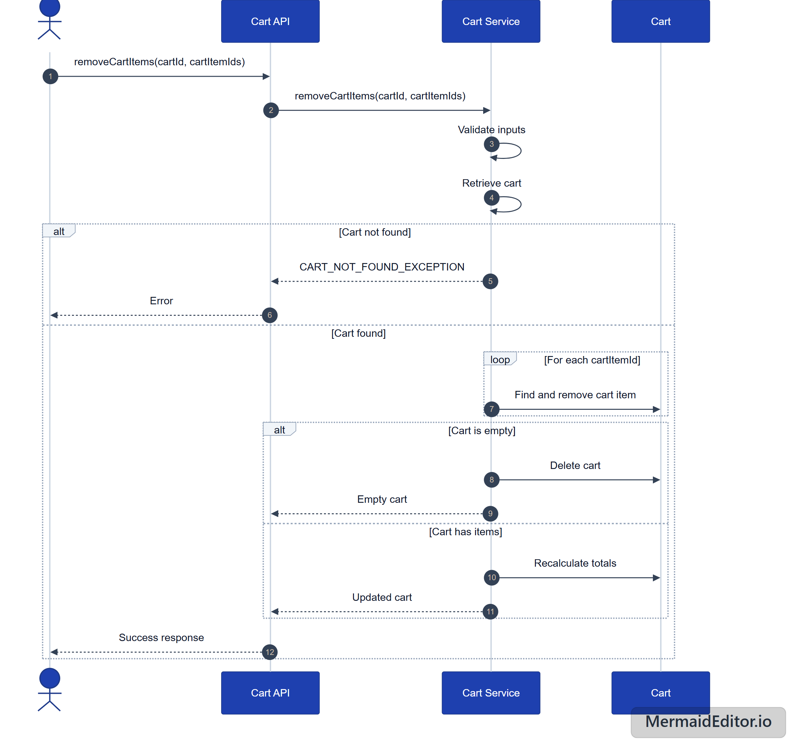
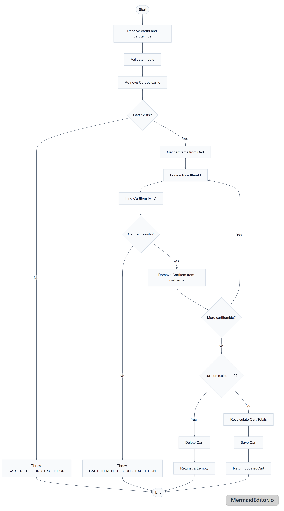

> [!NOTE]
> **Does not yet follow [`_use-case-template.md`](../../_use-case-template.md).**
> Relocated from `.docs/cart-management/remove-cart-item/` (GH-28); diagrams moved into `images/` and the links updated. Content is otherwise unchanged and still owned by its author.
>
> Still missing, for whoever picks this up:
>
> - **Actor**, **Preconditions**, **Postconditions** — none are stated.
> - **Business Rules** and **Exception Flows** — the pseudocode throws `CART_NOT_FOUND_EXCEPTION`, but the rejections are never listed with the message and status the caller sees.
> - **Data Model** — no tables or columns.
> - Diagrams are PNGs; the template asks for inline Mermaid so changes diff in PRs.

# Remove Items from Cart - Technical Documentation

## Overview
This document describes the functionality for removing items from a shopping cart in the Good Delivery application. The operation allows users to remove individual items or multiple items from their cart.

## Pseudo Code

```text
Transactional method
Cart Function removeCartItems(cartId, cartItemIds) {

validateInputs;

//Retrieve the customer's cart
cart = getCartById.orThrow(CART_NOT_FOUND_EXCEPTION);

cartItems = cart.getCartItems;

for (cartItemId : cartItemIds) {
cartItem = cartItems.findCartItemById(cartItemId)
.orThrow(CART_ITEM_NOT_FOUND_EXCEPTION);

cartItems.remove(cartItem);
}

if cartItems.size == 0 {
deleteCart(cart);
return null;
}

cart.recalculateTotals()
updatedCart = saveCart(cart);

return updated cart;

}
```

## Sequence Diagram


## Flow Diagram
