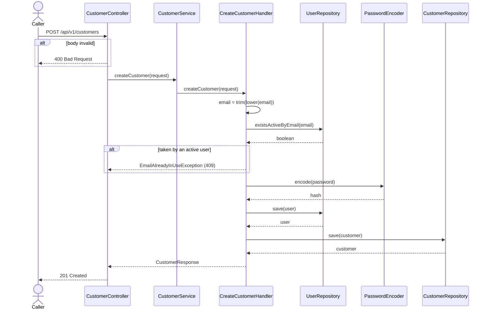

# Goal

Register a new customer: create their user account and the customer record linked to it.

Issue [#73](https://github.com/msmohammed0077-cmd/mentorship-restaurant/issues/73), under the
Customer Management umbrella [#68](https://github.com/msmohammed0077-cmd/mentorship-restaurant/issues/68).

## Actor

Anonymous caller (a prospective customer).

## Preconditions

None. The endpoint is open, as every endpoint is until auth lands.

## Scope

`POST /api/v1/customers` — **201** with the new customer's profile.

This is the first Customer Management sub-issue, so it also lays the foundation #69, #71 and #72
build on:

- Migration `V12`: profile columns on `users`, the `user_deleted_at` soft-delete marker, and the
  partial unique index on `lower(user_email)`.
- The `Gender` enum, the new `User` mappings, and plain `@NoArgsConstructor` on `User` and
  `Customer` (the handler builds both, the same exception `Cart` has).
- A BCrypt `PasswordEncoder` bean in `config/`. `spring-boot-starter-security` was already a
  dependency.
- `CustomerController`, `CustomerService`, `CustomerMapper`, `CustomerResponse`,
  `EmailAlreadyInUseException`.

## Business Rules

1. The email is **trimmed and lower-cased** before the uniqueness check and before it is stored.
2. An email already used by an **active** user is refused with 409. An email that belongs only to a
   soft-deleted user is **reusable**.
3. The password is stored as a **BCrypt hash** and never returned. It is write-only.
4. **One transaction**: the `users` row is inserted, then the `customers` row that links to it.
5. **No cart is created.** Carts are created lazily by add-cart-item; customer 3 has no cart by
   design.

## Authorisation

None, per #34's trade. Creating an account needs no identity anyway. The IDOR hole is in the
sibling endpoints: once #69/#71/#72 land, anyone can read, change or delete any customer by id.
Closing that belongs to auth, not to this umbrella.

## API

```http
POST /api/v1/customers
Content-Type: application/json
```

```json
{
  "name": "Sara Youssef",
  "email": "sara@example.com",
  "password": "s3cret-pass",
  "phone": "+201001234567",
  "date_of_birth": "1995-04-12",
  "gender": "FEMALE"
}
```

| Field | Rule |
| --- | --- |
| `name` | required, not blank, max 150 |
| `email` | required, valid email, max 255 |
| `password` | required, at least 8 characters and at most 72 bytes (UTF-8) |
| `phone` | optional, `^\+?[0-9]{7,15}$` |
| `date_of_birth` | optional, in the past |
| `gender` | optional, `MALE` or `FEMALE` |

Response, **201**:

```json
{
  "customer_id": 4,
  "name": "Sara Youssef",
  "email": "sara@example.com",
  "phone": "+201001234567",
  "date_of_birth": "1995-04-12",
  "gender": "FEMALE"
}
```

The API is snake_case (global Jackson setting). `password` is never in a response.

**Why 72 bytes:** BCrypt's input limit is 72 bytes, and Spring Security refuses longer passwords
at `encode` time. `@Size` counts characters, and a multi-byte character (`é`, an emoji) counts as
several bytes, so the upper bound is a custom `@MaxUtf8Bytes(72)` constraint. An over-long password
is a 400 from validation, never a failure inside the encoder.

**Whitespace around the email** is rejected with 400 by `@Email` before the handler runs, so over
HTTP the trim in rule 1 never finds anything to remove. It stays in the handler so the stored
value is normalised whatever the validator accepts. Lower-casing does all the real work.

## Data Model

`V12` adds to `users`, all nullable:

| Column | Type |
| --- | --- |
| `user_phone` | `VARCHAR(20)` |
| `user_date_of_birth` | `DATE` |
| `user_gender` | `VARCHAR(20)`, `Gender` stored by name |
| `user_deleted_at` | `TIMESTAMPTZ`, the soft-delete marker |

The profile lives on `users`, beside name, email and password. `customers` stays a thin link table,
like `restaurants`.

V1's plain `UNIQUE` on `user_email` (`users_user_email_key`) is replaced by:

```sql
CREATE UNIQUE INDEX uq_users_active_email
    ON users (lower(user_email))
    WHERE user_deleted_at IS NULL;
```

It is case-insensitive, and it lets a soft-deleted user's email be used again.

**The index is only the backstop.** The handler checks first with
`UserRepository.existsActiveByEmail`, which uses the same `lower(...)` and the same
`deleted_at IS NULL` filter. Two concurrent requests for the same email can both pass the check.
The index then refuses the second insert, which surfaces as a generic 500, not a 409. That is
accepted for now.

The check runs over **all users**, not only customers. A restaurant's email is taken too, because
the column is shared.

## Main Success Scenario

1. The caller submits name, email, password and optional profile fields.
2. The system validates the body's shape.
3. The system normalises the email and checks that no active user has it.
4. The system hashes the password, inserts the user, then the customer.
5. The system returns 201 with the profile.

## Exception Flows

- **2a. Body invalid** (a required field missing, bad email, password under 8 characters or over 72 bytes, bad phone, a
  date of birth not in the past, an unknown gender): 400.
- **3a. Email used by an active user:** 409, "Email is already in use".

## Postconditions

A `users` row with a BCrypt hash, and a `customers` row linked to it. No cart and no addresses.

## Diagram

### Sequence Diagram



## Structure

```text
CustomerController -> CustomerService        (delegates only)
                   -> CreateCustomerHandler  (@Service, @Transactional)
                   -> UserRepository         (existsActiveByEmail, save)
                   -> CustomerRepository     (save)
                   -> CustomerMapper         (CustomerResponse)
```

## Testing

`CreateCustomerEndpointTest`, end-to-end.

| Case | Expected |
| --- | --- |
| Happy path, mixed-case email | 201, fields match, email lower-cased, no `password`; the stored value is a hash that `PasswordEncoder.matches` |
| Email of seeded customer `ahmed.ali@example.com`, also upper-cased | 409 |
| Missing email and a 5-character password | 400 |
| Email of a soft-deleted user (marked deleted via SQL) | 201 |

Every email the test creates starts with `create.customer.test.`, and cleanup deletes only those
users. The `customers` rows go with them by cascade. Seeded customers 1–3 are never touched.

# Notes

1. **No cart on sign-up.** See rule 5.
2. **Concurrent duplicate sign-ups return 500, not 409.** See *Data Model*.
3. **IDOR on the sibling endpoints** is #34's accepted trade, tracked with auth.
