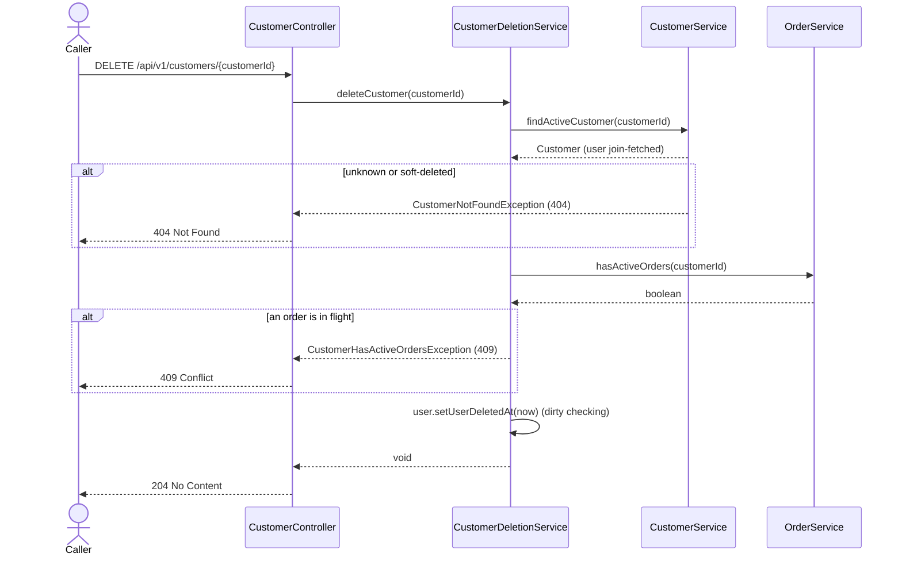

# Goal

Let a customer close their account without losing the history other people depend on.

Issue [#72](https://github.com/msmohammed0077-cmd/mentorship-restaurant/issues/72), under the
Customer Management umbrella [#68](https://github.com/msmohammed0077-cmd/mentorship-restaurant/issues/68).

## Actor

Any caller. There is no auth yet (see *Authorisation*).

## Preconditions

The customer exists, is not soft-deleted, and has no order in flight.

## Scope

`DELETE /api/v1/customers/{customerId}` — **204**, no body. A **soft** delete.

Builds on #73, #69 and #71 (`CustomerController`, `CustomerService`,
`CustomerRepository.findActiveById`). Adds `CustomerDeletionService.deleteCustomer`,
`CustomerHasActiveOrdersException`, `OrderService.hasActiveOrders` and
`OrderRepository.existsByCustomer_IdAndStatusIn`. Delete-customer has its own service because
it is the only customer use-case that needs the order domain (ADR 0004).

Also makes the older customer lookups outside this umbrella exclude soft-deleted customers (see
*Soft-deleted customers elsewhere*).

## Business Rules

1. An **unknown or already soft-deleted** customer is refused with 404, "Customer not found"
   (`findActiveById`). Deleting twice is therefore a 404 the second time, not a silent 204.
2. A customer with an order in a **non-terminal** status — `PLACED`, `ACCEPTED`, `PREPARING`,
   `READY_FOR_PICKUP`, `PICKED_UP` — is refused with **409**, "Customer has active orders"
   (`CustomerHasActiveOrdersException`). A restaurant must never lose the customer of an order in
   flight. The set of active statuses is derived from `OrderStatus.isTerminal()`, so a new status
   is classified in one place.
3. Otherwise `user_deleted_at` is set to now on the customer's user.
4. **Past orders, ratings, addresses and the cart are kept.** Nothing is deleted. Until #84 the
   cart was deleted too; the cart-by-id endpoints can still reach the kept cart, which
   [#104](https://github.com/msmohammed0077-cmd/mentorship-restaurant/issues/104) tracks.
5. Afterwards the customer **does not exist** to the API: `GET`, `PATCH`, the password endpoint,
   every address operation, add-to-cart, order history, cancel and rate all return 404, "Customer
   not found" (for address and order operations, on their own address or order — see *Soft-deleted
   customers elsewhere*). Their email is **reusable** by a new sign-up, because the partial unique index
   `uq_users_active_email` only covers active users.

## Authorisation

None, per #34's trade. This is an **IDOR**: anyone can delete any customer's account by id.
Closing it belongs to auth, not to this umbrella.

## API

```http
DELETE /api/v1/customers/4
```

Response, **204**, no body.

## Data Access

```java
boolean existsByCustomer_IdAndStatusIn(Long customerId, Collection<OrderStatus> statuses);
```

A derived `exists` query: one `select … limit 1`, no entity loaded. `CustomerDeletionService`
reaches it through `OrderService.hasActiveOrders`, never the repository (ADR 0004).

## Soft-deleted customers elsewhere

#68 says soft-deleted customers do not exist to the API, but the address, cart and order lookups
predate that and looked customers up with plain `findById` / `existsById`. They now filter
`user.userDeletedAt is null` too:

| Service | Before | Now |
| --- | --- | --- |
| `AddressService.viewAddresses` | `findByIdWithAddresses` (no filter) | `findByIdWithAddresses` (filters soft-deleted) |
| `AddressService.addAddress` | `findById` | `findActiveById` |
| `CartService.addItem` | `findById` | `findActiveById`, through `CustomerService.findActiveCustomer` |
| `OrderHistoryService.viewOrderHistory` | `existsById` | `existsActiveById` (new), through `CustomerService.ensureActiveCustomerExists` |

Update / set-default / delete address and cancel / rate order look up the address or order, not the
customer, so there was no customer lookup to filter. [#78](https://github.com/msmohammed0077-cmd/mentorship-restaurant/issues/78)
makes that lookup fetch the owner's user in the same query (a join fetch, or for cancel a projection
in the `CUSTOMER` ownership branch of `OrderStatusService`) and checks `userDeletedAt` in
Java, after the not-found and ownership checks. A soft-deleted customer acting on their own address
or order gets 404 "Customer not found"; on a missing or another customer's row they get the same
address- or order-level answer as anyone else. A deleted customer's cart is kept, and the cart-by-id
endpoints do not check its owner, so they still reach it: #104.

## Main Success Scenario

1. The caller asks to delete a customer by id.
2. The system loads the active customer and its user.
3. The system checks the customer has no order in a non-terminal status.
4. The system sets `user_deleted_at` on the user.
5. The system returns 204.

## Exception Flows

- **1a. Id is not a number:** 400 (type mismatch, before the service runs).
- **2a. No active customer with that id** (unknown, or already deleted): 404, "Customer not found".
- **3a. An order is still in flight:** 409, "Customer has active orders". Nothing changes.

## Postconditions

- `users.user_deleted_at` is set; the `users` and `customers` rows remain.
- Orders, order items, ratings, addresses, the cart and its items are unchanged.

## Diagram

### Sequence Diagram



## Structure

```text
CustomerController -> CustomerDeletionService  (@Service, @Transactional; its own service, ADR 0004)
                   -> CustomerService          (findActiveCustomer -> CustomerRepository.findActiveById)
                   -> OrderService             (hasActiveOrders -> OrderRepository.existsByCustomer_IdAndStatusIn)
```

## Testing

`DeleteCustomerEndpointTest`, end-to-end, on customers the test creates through
`POST /api/v1/customers`. Seeded customers 1–3 are never touched.

| Case | Expected |
| --- | --- |
| Delete a new customer | 204; then `GET` → 404; a second `DELETE` → 404, "Customer not found" |
| Customer with a cart (seeded via SQL) | 204; the cart is still there (#104) |
| Customer with a `PLACED` order (seeded via SQL) | 409, "Customer has active orders"; `GET` still 200 |
| Unknown id `999999` | 404, "Customer not found" |
| Address list for a deleted customer | 404, "Customer not found" |

Every email the test creates starts with `delete.customer.test.`, and cleanup deletes only those
users. The `customers` rows, and the carts, cart items and orders seeded for them, go with them by
cascade.

# Notes

1. **Address update / set-default / delete, and order cancel / rate** used to reach a deleted
   customer's rows; closed by #78 (see *Soft-deleted customers elsewhere*).
2. **No restore.** Undeleting is not exposed; it would also have to handle the email having been
   reused meanwhile.
3. **A check-then-act race.** An order placed between the active-order check and the commit is not
   seen. The window is one short transaction. Accepted. The cart used to be deleted in the same
   transaction; it is kept now, and what can still reach it is #104's to close.
4. **IDOR** is #34's accepted trade, tracked with auth.
