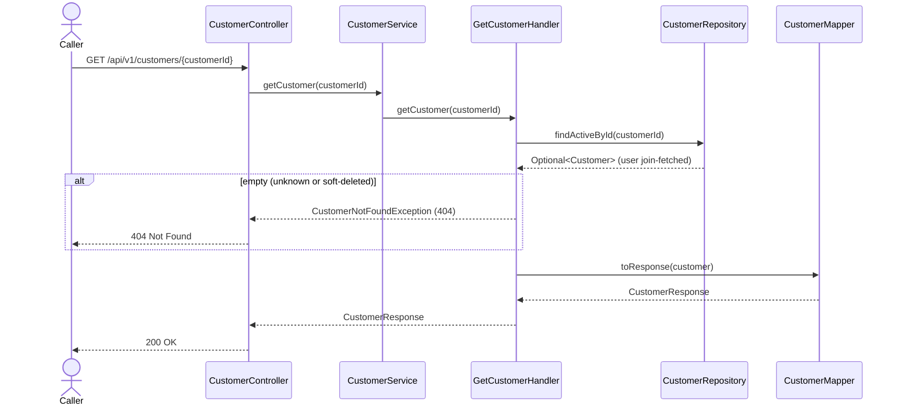

# Goal

Read one customer's profile by id.

Issue [#69](https://github.com/msmohammed0077-cmd/mentorship-restaurant/issues/69), under the
Customer Management umbrella [#68](https://github.com/msmohammed0077-cmd/mentorship-restaurant/issues/68).

## Actor

Any caller. There is no auth yet (see *Authorisation*).

## Preconditions

None beyond the customer existing and not being soft-deleted.

## Scope

`GET /api/v1/customers/{customerId}` — **200** with the customer's profile.

Builds on #73 (`CustomerController`, `CustomerService`, `CustomerMapper`, `CustomerResponse`). Adds
`CustomerRepository.findActiveById` and `GetCustomerHandler`.

## Business Rules

1. An **unknown or soft-deleted** customer is refused with 404, "Customer not found". Soft-deleted
   customers do not exist to the API: the lookup is `CustomerRepository.findActiveById`, which
   filters `user.userDeletedAt is null`.
2. The password is **never** in the response.
3. **Read-only.** No business state is validated; a read reports what is there.
4. **Addresses are not embedded.** They have their own endpoint,
   `GET /api/v1/addresses?customerId=`.

## Authorisation

None, per #34's trade. This is an **IDOR**: anyone can read any customer's profile — name, email,
phone, date of birth — by guessing or enumerating ids. Closing it belongs to auth, not to this
umbrella.

## API

```http
GET /api/v1/customers/1
```

Response, **200**:

```json
{
  "customer_id": 1,
  "name": "Ahmed Ali",
  "email": "ahmed.ali@example.com",
  "phone": null,
  "date_of_birth": null,
  "gender": null
}
```

The API is snake_case (global Jackson setting). The profile fields added by `V12` are nullable, so
seeded customers return `null` for them.

## Data Access

```java
@Query("""
    select customer from Customer customer
    join fetch customer.user user
    where customer.id = :customerId and user.userDeletedAt is null
    """)
Optional<Customer> findActiveById(Long customerId);
```

**Why join-fetch:** `Customer.user` is `LAZY` and `spring.jpa.open-in-view` is `false`.
`CustomerMapper` reads the user, so a plain `findById` would either hit a lazy proxy outside the
session or cost a second query. The fetch join loads both in one statement, and the soft-delete
filter rides on the same join. #71 and #72 should reuse this method for their "customer exists"
check, so every customer lookup excludes deleted users the same way.

## Main Success Scenario

1. The caller requests a customer by id.
2. The system loads the customer and its user, excluding soft-deleted users.
3. The system returns 200 with the profile.

## Exception Flows

- **1a. Id is not a number:** 400 (type mismatch, before the handler runs).
- **2a. No active customer with that id:** 404, "Customer not found".

## Postconditions

Nothing changes.

## Diagram

### Sequence Diagram



## Structure

```text
CustomerController -> CustomerService     (delegates only)
                   -> GetCustomerHandler  (@Service, @Transactional(readOnly = true))
                   -> CustomerRepository  (findActiveById)
                   -> CustomerMapper      (CustomerResponse)
```

## Testing

`GetCustomerEndpointTest`, end-to-end.

| Case | Expected |
| --- | --- |
| Seeded customer 1 | 200, name `Ahmed Ali`, email `ahmed.ali@example.com`, no `password` |
| Unknown id `999999` | 404, "Customer not found" |
| Soft-deleted customer (created via the API, marked deleted via SQL) | 404 |

Every email the test creates starts with `get.customer.test.`, and cleanup deletes only those
users. The `customers` rows go with them by cascade. Seeded customers 1–3 are only read.

# Notes

1. **IDOR** is #34's accepted trade, tracked with auth.
2. **No addresses in the profile.** See rule 4.
