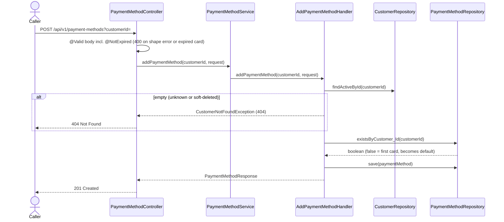
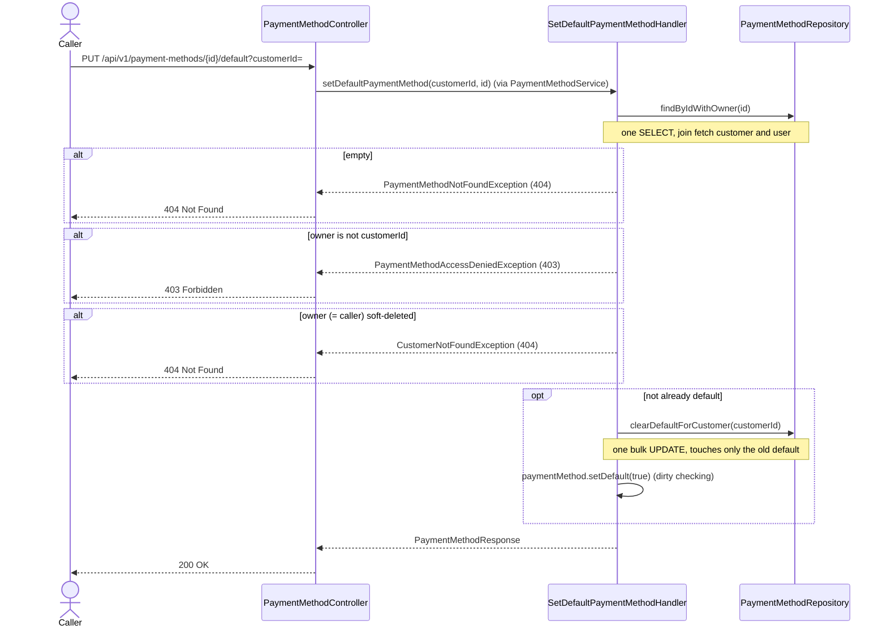

# Goal

Let a customer keep saved cards to pay with: add one, list them, pick a default, delete one.

Issue [#70](https://github.com/msmohammed0077-cmd/mentorship-restaurant/issues/70), under the
Customer Management umbrella [#68](https://github.com/msmohammed0077-cmd/mentorship-restaurant/issues/68).
The rules deliberately mirror [address management](../address-management/address-management.md),
so the two features behave alike.

## Actor

Any caller. There is no auth yet (see *Authorisation*).

## Preconditions

1. The customer exists and is not soft-deleted.
2. The request supplies `customerId` as a request parameter, as addresses do. Ownership checks use
   it in place of a logged-in principal.

## Scope

| Action | Endpoint | Success |
| --- | --- | --- |
| Add | `POST /api/v1/payment-methods?customerId={customerId}` | 201 + `PaymentMethodResponse` |
| List | `GET /api/v1/payment-methods?customerId={customerId}` | 200 + list |
| Set default | `PUT /api/v1/payment-methods/{paymentMethodId}/default?customerId={customerId}` | 200 + `PaymentMethodResponse` |
| Delete | `DELETE /api/v1/payment-methods/{paymentMethodId}?customerId={customerId}` | 204 |

Adds migration `V13__create_payment_methods.sql`, the `PaymentMethod` entity and `CardBrand` enum,
`PaymentMethodRepository`, `AddPaymentMethodHandler`, `ViewPaymentMethodsHandler`,
`SetDefaultPaymentMethodHandler`, `DeletePaymentMethodHandler`, `PaymentMethodService`,
`PaymentMethodController`, `PaymentMethodMapper`, two exceptions, and the `@NotExpired` request
constraint. Builds on `CustomerRepository.findActiveById` from #69 and #72, and adds
`CustomerRepository.findByIdWithPaymentMethods` and the `Customer.paymentMethods` collection.

### What a payment method is

**Display metadata only.** There is no payment gateway. The API never accepts or stores a full card
number (PAN) or a CVV — that would put the project in PCI-DSS scope. A request carries only what a
"saved cards" screen shows: brand, last four digits, expiry, holder name.

## Business Rules

1. An **unknown or soft-deleted customer** is refused with 404, "Customer not found", on add and
   list. On set default and delete the card is looked up first, so the customer check applies only
   once the card is known to be the caller's (rule 6).
2. The **first payment method** a customer adds becomes the default; later ones are non-default.
3. An **expired card** is refused on add with **400**, "expiryMonth must not be before the current
   month". A card is valid through the end of its expiry month: it is expired iff
   `YearMonth.of(year, month).isBefore(YearMonth.now())`. The check is the class-level
   `@NotExpired` constraint on `AddPaymentMethodRequest` (validator in
   `customer/model/validation/`): it depends only on request fields and today's date, so per the
   validation rule it belongs on the request, not in the handler. It reports on the
   `expiryMonth` property because `GlobalExceptionHandler` formats field errors only, and it passes
   when either field is missing or the month is out of range, leaving those to the field
   constraints. Because it runs before the handler, an expired card for an unknown customer is a
   400, not a 404.
4. **At most one default per customer**, enforced by the partial unique index
   `uq_payment_methods_one_default_per_customer` (as V8 does for addresses). Setting a default
   clears the previous one first. Setting the card that is already default returns it unchanged.
5. Delete is a **hard delete**. Deleting the default does **not** promote another card.
6. Set default and delete load the card with its owner in one query and check, in this order:
   1. **Unknown** id: **404**, "Payment method not found" (`PaymentMethodNotFoundException`).
   2. Card **belongs to another customer**: **403**, "Payment method belongs to another customer"
      (`PaymentMethodAccessDeniedException`).
   3. Owner **soft-deleted**: **404**, "Customer not found". The owner is the caller at this point,
      so this is the caller's own soft delete.

   The customer is never checked on its own, which shifts two edges compared with checking it
   first: an unknown or soft-deleted caller asking for **another customer's card** gets **403**, and
   asking for a **nonexistent card** gets **404 "Payment method not found"** rather than "Customer
   not found". Likewise a soft-deleted customer's card asked for by someone else is a 403. All of
   this is inside the accepted IDOR (see *Authorisation*); it trades a slightly less precise error
   for one query instead of two.
7. The list is a read: **expired saved cards are still listed**. Reads do not validate business
   state. Order: default first, then newest.
8. **No duplicate detection** — the same brand and last four digits may be saved twice. Without the
   PAN two cards cannot reliably be told apart.
9. **Soft-deleting a customer keeps their payment methods**, like their addresses, for history.
   They are unreachable through the API because rules 1 and 6 refuse a soft-deleted owner.

## Authorisation

None, per #34's trade. This is an **IDOR**: anyone can list, add, change or delete any customer's
saved cards by passing their `customerId`. Closing it belongs to auth, not to this umbrella.

## API

### Add

```http
POST /api/v1/payment-methods?customerId=4
Content-Type: application/json

{
  "brand": "VISA",
  "last4": "4242",
  "expiry_month": 9,
  "expiry_year": 2028,
  "holder_name": "Sara Youssef"
}
```

| Field | Rule |
| --- | --- |
| `brand` | required; `VISA`, `MASTERCARD`, `AMEX` or `MEEZA` |
| `last4` | required; exactly four digits (`^[0-9]{4}$`) |
| `expiry_month` | required; 1..12 |
| `expiry_year` | required; 2000..2100 |
| `expiry_month` + `expiry_year` | not before the current month (`@NotExpired`, reported on `expiryMonth`) |
| `holder_name` | required, not blank; at most 150 characters |

Response, **201**:

```json
{
  "payment_method_id": 7,
  "brand": "VISA",
  "last4": "4242",
  "expiry_month": 9,
  "expiry_year": 2028,
  "holder_name": "Sara Youssef",
  "is_default": true
}
```

### List

`GET /api/v1/payment-methods?customerId=4` — **200**, an array of the same shape (empty when the
customer has none).

### Set default

`PUT /api/v1/payment-methods/7/default?customerId=4` — **200**, the card with `is_default: true`.

### Delete

`DELETE /api/v1/payment-methods/7?customerId=4` — **204**, no body.

## Data Access

`payment_methods` (V13): `payment_method_id`, `customer_id` (FK `customers`, `ON DELETE CASCADE`,
indexed), `payment_method_brand`, `payment_method_last4` (`CHAR(4)`),
`payment_method_expiry_month` (`SMALLINT`, `CHECK 1..12`), `payment_method_expiry_year`
(`SMALLINT`), `payment_method_holder_name`, `payment_method_is_default`,
`payment_method_created_at`.

`PaymentMethodRepository`:

| Method | Used by | Notes |
| --- | --- | --- |
| `existsByCustomer_Id` | add | decides whether the new card is the first |
| `findByIdWithOwner` | set default, delete | by payment-method id only; `join fetch` the customer and its user, **no** soft-delete filter — the handler decides (rule 6) |
| `clearDefaultForCustomer` | set default | `@Modifying(flushAutomatically = true)`, one `UPDATE` scoped to the customer |

`CustomerRepository`:

| Method | Used by | Notes |
| --- | --- | --- |
| `findActiveById` | add | the entity is needed to link the card |
| `findByIdWithPaymentMethods` | list | `join fetch` user, `left join fetch` `paymentMethods`, filters `userDeletedAt is null`; empty = 404 customer. Mirrors `findByIdWithAddresses` |

`Customer.paymentMethods` is `@OneToMany(mappedBy = "customer")` with
`@OrderBy("isDefault DESC, createdAt DESC, id DESC")`, so the list order lives on the mapping and
the fetch query emits it as `ORDER BY`.

### Statements per request

Captured with `SPRING_JPA_SHOW_SQL=true` from the end-to-end tests.

| Request | Statements |
| --- | --- |
| Add | 3: `SELECT` customer + user, `SELECT` exists-first-card, `INSERT` (an expired card: 0, refused at validation) |
| List | 1: `SELECT` customer + user `LEFT JOIN` payment_methods `ORDER BY` default, created, id |
| Set default (not yet default) | 3: `SELECT` card + customer + user, bulk `UPDATE` clearing the old default, `UPDATE` of this card by dirty checking |
| Set default (already default) | 1: the `SELECT` |
| Delete | 2: `SELECT` card + customer + user, `DELETE` |
| Any refusal on set default / delete | 1: the `SELECT` |

Set default cannot be a single statement. The partial unique index is not deferrable, and
Postgres checks it row by row, so one `UPDATE ... SET is_default = (id = :id)` can transiently see
two defaults and fail depending on row order. Clearing first and setting second is the only order
that never violates it.

**Bulk query vs managed entity.** Set default loads the chosen card (with its customer and user,
which the bulk query does not touch either), then runs the bulk `UPDATE`
that clears the old default. The bulk query bypasses the persistence context, but it only touches
the *old* default row, never the loaded one, so the loaded entity is still accurate. The handler
then sets `isDefault` on it and dirty checking writes it at commit — after the old default was
cleared, so the partial unique index is never violated. No `clearAutomatically`, no `save()`. Same
shape as `SetDefaultAddressHandler`.

## Main Success Scenarios

### Add

1. The caller submits a card for a customer.
2. The system validates the body, including that the card is not expired (400 before the handler).
3. The system loads the active customer.
4. The system marks it default if the customer has no card yet.
5. The system saves it and returns 201.

### List

1. The caller asks for a customer's cards.
2. The system loads the active customer with their cards in one query (none: 404).
3. The system returns the cards, default first, then newest.

### Set default

1. The caller picks a card as default.
2. The system loads the card with its owner, checks it belongs to the caller, then that the caller
   is not soft-deleted.
3. If it is not already default, the system clears the customer's current default and sets this one.
4. The system returns the card.

### Delete

1. The caller deletes a card.
2. The system loads the card with its owner, checks it belongs to the caller, then that the caller
   is not soft-deleted.
3. The system deletes it and returns 204.

## Exception Flows

- **Body invalid** (missing field, `last4` not four digits, month out of range, unknown brand, or
  an expired card — "expiryMonth must not be before the current month"): 400, before the handler
  runs. Nothing is saved.
- **`customerId` or path id missing or not a number:** 400.
- **Customer unknown or soft-deleted** (add, list): 404, "Customer not found".
- **Payment method unknown** (set default, delete): 404, "Payment method not found" — whatever the
  caller.
- **Payment method belongs to another customer** (set default, delete): 403, "Payment method
  belongs to another customer" — whatever the caller. Nothing changes.
- **Caller soft-deleted, card is theirs** (set default, delete): 404, "Customer not found". Nothing
  changes.

## Diagram

### Add



### Set default



Delete applies the same three checks as set default and removes the row. List is one
`findByIdWithPaymentMethods` call: empty is a 404, otherwise the collection is mapped.

## Structure

```text
PaymentMethodController -> PaymentMethodService            (delegates only)
                        -> AddPaymentMethodHandler         (@Transactional)
                        -> ViewPaymentMethodsHandler       (@Transactional(readOnly = true))
                        -> SetDefaultPaymentMethodHandler  (@Transactional)
                        -> DeletePaymentMethodHandler      (@Transactional)
                        -> CustomerRepository, PaymentMethodRepository
                        -> PaymentMethodMapper             (responses)
```

## Testing

One end-to-end class per use-case, on customers and cards the tests insert with SQL
(`insertCustomer`, `insertPaymentMethod`, `softDeleteCustomer`); seeded customers 1–3 are never
touched and the only HTTP call is to the endpoint under test. Shared setup is in
`support/PaymentMethodEndpointTestSupport`. Expiry dates are computed from today
(`YearMonth.now().plusYears(2)` / `minusMonths(1)`), never hard-coded.

| Class | Case | Expected |
| --- | --- | --- |
| `AddPaymentMethodEndpointTest` | first card | 201, `is_default: true`, fields echoed |
| | second card | 201, `is_default: false` |
| | expired card | 400, "expiryMonth must not be before the current month" |
| | `last4: "12a4"` | 400 |
| | unknown customer `999999` | 404, "Customer not found" |
| `ViewPaymentMethodsEndpointTest` | three cards | default first, then newest |
| | customer with none | 200, `[]` |
| | soft-deleted customer | 404, "Customer not found" |
| `SetDefaultPaymentMethodEndpointTest` | switch default | 200; the database has the new default and the old one non-default |
| | another customer's card | 403 |
| | unknown id `999999` | 404, "Payment method not found" |
| | soft-deleted caller, own card | 404, "Customer not found"; still not default |
| `DeletePaymentMethodEndpointTest` | delete own card | 204; no card left in the database |
| | another customer's card | 403; the owner still has it |
| | soft-deleted caller, own card | 404, "Customer not found"; the card remains |

Each class has its own email prefix (e.g. `add.payment.method.test.`), and cleanup deletes only
those users. Their `customers` and `payment_methods` rows go with them by `ON DELETE CASCADE`.

# Notes

1. **`YearMonth.now()` uses the server's default time zone.** Around midnight on the first of a
   month a card can be accepted or refused a few hours early or late relative to the customer's
   zone. Accepted.
2. **Concurrent first adds.** Two cards added at the same moment for a customer with none can both
   see "no card yet"; the partial unique index then rejects the second as a generic 500, not a
   clean error. Same trade as addresses.
3. **Concurrent set-defaults** likewise race on the index. Accepted.
4. **IDOR** is #34's accepted trade, tracked with auth.
