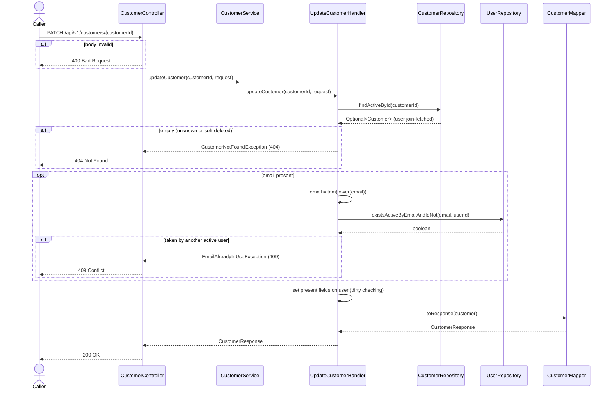
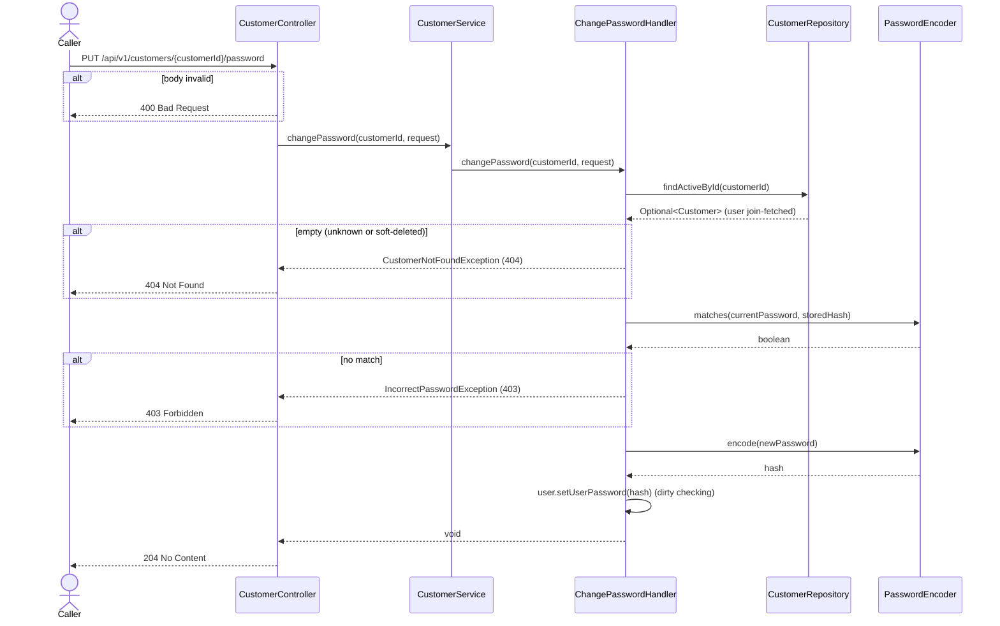

# Goal

Let a customer edit their profile, and change their password as a separate, verified step.

Issue [#71](https://github.com/msmohammed0077-cmd/mentorship-restaurant/issues/71), under the
Customer Management umbrella [#68](https://github.com/msmohammed0077-cmd/mentorship-restaurant/issues/68).

## Actor

Any caller. There is no auth yet (see *Authorisation*).

## Preconditions

The customer exists and is not soft-deleted.

## Scope

Two endpoints:

- `PATCH /api/v1/customers/{customerId}` — **200** with the updated profile.
- `PUT /api/v1/customers/{customerId}/password` — **204**, no body.

Builds on #73 and #69 (`CustomerController`, `CustomerService`, `CustomerMapper`,
`CustomerRepository.findActiveById`). Adds `UpdateCustomerRequest`, `ChangePasswordRequest`,
`UpdateCustomerHandler`, `ChangePasswordHandler`, `UserRepository.existsActiveByEmailAndIdNot` and
`IncorrectPasswordException`.

**Why two endpoints.** Profile edits and credential changes follow different rules. Anyone can
reach any customer id (the accepted IDOR below), so a password field in the PATCH would turn "anyone
can edit a profile" into "anyone can take over an account". The password endpoint demands the
current password; the PATCH has no `password` field at all.

## Business Rules

### Update profile

1. An **unknown or soft-deleted** customer is refused with 404, "Customer not found"
   (`findActiveById`).
2. Every field is **optional. Absent or `null` means unchanged.** Only the fields sent are written.
3. The email is **trimmed and lower-cased**, as on create. If another **active** user has it, 409,
   "Email is already in use". Re-sending your own email is not a conflict:
   `existsActiveByEmailAndIdNot` excludes the caller's own user.
4. **Optional fields cannot be cleared** through this endpoint. Because `null` means "leave as is",
   there is no way to set `phone`, `date_of_birth` or `gender` back to `null`. Accepted limitation.
5. A `password` property in the body is **ignored**, like any unknown property. Use the password
   endpoint.
6. The customer is a **managed entity**: the handler mutates `customer.getUser()` and dirty checking
   issues the `UPDATE`. No `save()`.

### Change password

1. An **unknown or soft-deleted** customer is refused with 404, "Customer not found".
2. `current_password` must match the stored BCrypt hash, otherwise **403**, "Current password is
   incorrect" (`IncorrectPasswordException`).
3. The **BCrypt hash** of `new_password` is stored. Neither password is ever returned.

## Authorisation

None, per #34's trade. This is an **IDOR**: anyone can edit any customer's profile, including the
email, by id. Requiring the current password is what keeps the IDOR from becoming account
takeover. Closing the IDOR belongs to auth, not to this umbrella.

## API

### Update profile

```http
PATCH /api/v1/customers/4
Content-Type: application/json
```

```json
{
  "name": "Sara Hassan",
  "phone": "+201009876543"
}
```

| Field | Rule when present |
| --- | --- |
| `name` | not blank, max 150 |
| `email` | not blank, valid email, max 255 |
| `phone` | `^\+?[0-9]{7,15}$` |
| `date_of_birth` | in the past |
| `gender` | `MALE` or `FEMALE` |

Response, **200**, the full profile:

```json
{
  "customer_id": 4,
  "name": "Sara Hassan",
  "email": "sara@example.com",
  "phone": "+201009876543",
  "date_of_birth": "1995-04-12",
  "gender": "FEMALE"
}
```

**Not blank when present.** `@NotBlank` would also reject `null`, which here means "unchanged", so
`name` and `email` use `@Pattern(regexp = "(?s).*\\S.*")` instead: `null` passes, `""` and
`"   "` do not. `email` needs it too, because `@Email` accepts an empty string.

### Change password

```http
PUT /api/v1/customers/4/password
Content-Type: application/json
```

```json
{
  "current_password": "s3cret-pass",
  "new_password": "n3w-secret-pass"
}
```

| Field | Rule |
| --- | --- |
| `current_password` | required, not blank, at most 72 bytes (UTF-8) |
| `new_password` | required, at least 8 characters and at most 72 bytes (UTF-8) — BCrypt refuses longer input, see the create-customer spec |

Response, **204**, no body.

`PUT` because the password is a sub-resource replaced whole. `current_password` has no minimum: it
only has to match what is stored. Its 72-byte cap exists because no stored password can be longer
and BCrypt refuses longer input, so it is a 400 rather than a failure inside the encoder.

## Data Access

```java
@Query("""
    select count(user) > 0 from User user
    where lower(user.userEmail) = lower(:email)
      and user.userDeletedAt is null
      and user.id <> :userId
    """)
boolean existsActiveByEmailAndIdNot(String email, Long userId);
```

The same check as `existsActiveByEmail`, minus the caller's own user. As on create, it covers all
users, not only customers, and the partial unique index `uq_users_active_email` is the backstop: two
concurrent updates to the same email can both pass the check, and the loser surfaces as a generic
500 rather than a 409. Accepted, as on create.

## Main Success Scenario

### Update profile

1. The caller sends the fields to change.
2. The system validates the shape of the fields that are present.
3. The system loads the active customer and its user.
4. If an email is present, the system normalises it and checks no other active user has it.
5. The system writes the present fields; dirty checking updates the row.
6. The system returns 200 with the profile.

### Change password

1. The caller sends the current and the new password.
2. The system validates the body's shape.
3. The system loads the active customer and its user.
4. The system checks the current password against the stored hash.
5. The system stores the hash of the new password and returns 204.

## Exception Flows

- **Id is not a number:** 400 (type mismatch, before the handler runs).
- **Update, 2a. A present field is invalid** (blank name, bad or blank email, bad phone, a date of
  birth not in the past, an unknown gender): 400.
- **Update, 3a / Change password, 3a. No active customer with that id:** 404, "Customer not found".
- **Update, 4a. Email used by another active user:** 409, "Email is already in use".
- **Change password, 2a. A field missing, or `new_password` under 8 characters or over 72 bytes, or `current_password` over 72 bytes:** 400.
- **Change password, 4a. Current password does not match:** 403, "Current password is incorrect".

## Postconditions

- Update: the sent fields are changed on the `users` row; everything else is as it was.
- Change password: `user_password` holds a BCrypt hash of the new password.

## Diagram

### Sequence Diagram — update profile



### Sequence Diagram — change password



## Structure

```text
CustomerController -> CustomerService        (delegates only)
                   -> UpdateCustomerHandler  (@Service, @Transactional)
                   -> ChangePasswordHandler  (@Service, @Transactional)
                   -> CustomerRepository     (findActiveById)
                   -> UserRepository         (existsActiveByEmailAndIdNot)
                   -> PasswordEncoder        (matches, encode)
                   -> CustomerMapper         (CustomerResponse)
```

## Testing

End-to-end, on customers the tests create through `POST /api/v1/customers`. Seeded customers 1–3
are never mutated.

`UpdateCustomerEndpointTest`:

| Case | Expected |
| --- | --- |
| PATCH `name` + `phone` | 200, both changed; email, date of birth and gender unchanged |
| PATCH `email` to seeded customer 1's `ahmed.ali@example.com` | 409, "Email is already in use" |
| PATCH unknown id `999999` | 404, "Customer not found" |
| PATCH `email` = `not-an-email` | 400 |

`ChangePasswordEndpointTest`:

| Case | Expected |
| --- | --- |
| Correct current password | 204; the stored hash `PasswordEncoder.matches` the new password |
| Wrong current password | 403, "Current password is incorrect" |

Each class creates emails under its own prefix (`update.customer.test.`,
`change.password.test.`), and cleanup deletes only those users. The `customers` rows go with them by
cascade.

# Notes

1. **Optional fields cannot be cleared.** See rule 4. Clearing would need explicit-null handling
   (e.g. JSON Merge Patch), which is not worth it yet.
2. **Password changes need the current password.** Decided in #71 to keep the IDOR from becoming
   account takeover.
3. **Concurrent updates to the same email return 500, not 409.** See *Data Access*.
4. **IDOR** is #34's accepted trade, tracked with auth.
