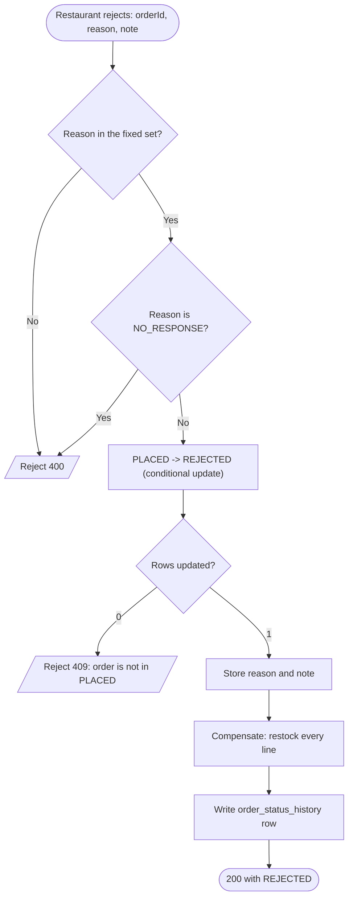

# Goal

Let a restaurant accept or reject an order, and undo everything a rejection wasted.

Issue [#48](https://github.com/msmohammed0077-cmd/mentorship-restaurant/issues/48), under the
Order Management umbrella [#34](https://github.com/msmohammed0077-cmd/mentorship-restaurant/issues/34).
Depends on [#47](https://github.com/msmohammed0077-cmd/mentorship-restaurant/issues/47) for the
vocabulary and the transition mechanism.

## Actor

Restaurant. Also **System**, for the 15-minute auto-reject.

## Preconditions

1. The order exists and is in `PLACED`.
2. The caller is the restaurant that owns the order.

## Scope

1. `POST /api/v1/orders/{orderId}/accept` — optional `prep_time_minutes`.
2. `POST /api/v1/orders/{orderId}/reject` — a reason from a fixed set, plus an optional note.
3. **The shared compensation path.** Restock what checkout consumed.
   [#41](https://github.com/msmohammed0077-cmd/mentorship-restaurant/issues/41) calls this; it does
   not write its own.
4. Auto-reject after 15 minutes in `PLACED`, with a system reason.

It does not deliver cancel (#41) or order creation (#35).

## Business Rules

1. **Accept and reject are only legal from `PLACED`.** Enforced by #47's transition table and its
   conditional update, not re-checked here.
2. **Reject after accepting is not allowed.** Once accepted the restaurant is committed. It is not a
   cancel either — cancel is customer-only, and #41's.
3. **Rejection restores stock.** #35 decremented at checkout, so reject puts it back. Accept does not
   touch stock.
4. **A rejection reason is required and must be from the fixed set.** The note is optional.
5. **Prep time is optional and nothing consumes it.**

## The compensation path

Restock, refund and coupon release are needed identically by **reject here** and **cancel in #41**.
Cancel is only legal while `PLACED`, and reject only happens from `PLACED`, so **they are the same
operation from the same state**. It is written once, here, as `CompensateOrderHandler`.

Two copies of this would drift, and the copy that drifts is the one that silently fails to restore
stock.

| Step | Status |
| --- | --- |
| **Restock** — return each line's quantity to `menu_items.menu_item_stock` | **Implemented** |
| **Refund** | **Not implemented.** There is no payment in this codebase — checkout's "Payment successful" is a hardcoded string. When payment is real, it belongs in this method. |
| **Release coupon** | **Not implemented.** There are no coupons in this codebase — no table, no entity, no endpoint. When they exist, they belong in this method. |

The two unimplemented steps are named in the handler rather than silently absent, so the next person
adds them here instead of discovering the gap in production. This use-case does **not** fake them
with empty no-op classes; an empty class that looks implemented is worse than an absence that is
documented.

**Restock is one statement per line, not a read-modify-write:**

```sql
UPDATE menu_items
SET menu_item_stock = menu_item_stock + :quantity
WHERE menu_item_id = :menuItemId
```

Reading the stock and writing it back would lose a concurrent sale.

## Rejection reasons

A fixed set plus an optional free-text note. The set is what the customer sees and what you can
report on; the note covers what the set does not.

| Reason | Who may use it |
| --- | --- |
| `OUT_OF_INGREDIENTS` | Restaurant |
| `TOO_BUSY` | Restaurant |
| `CLOSING_SOON` | Restaurant |
| `OTHER` | Restaurant |
| `NO_RESPONSE` | **System only** — the 15-minute auto-reject |

`NO_RESPONSE` is an addition to the set #48 lists. The issue calls for "a system reason" without
naming one, and reusing `OTHER` would make an unanswered order indistinguishable from a restaurant
that chose not to explain itself — which is exactly the thing you would want to report on. A
restaurant supplying `NO_RESPONSE` is rejected with 400.

## Auto-reject

An order left in `PLACED` for 15 minutes is rejected by `SYSTEM` with `NO_RESPONSE`.

**Not a separate `expired` status.** #34 settled this: expiry writes `rejected` so it shares one
cleanup path. A second terminal status would mean a second compensation path, and the second one is
the one that rots.

A `@Scheduled` sweep runs every minute and rejects each order past the deadline. It reuses the same
transition and the same compensation as a manual rejection — the only difference is the actor and
the reason. The sweep is **not** idempotency-critical: the conditional update means an order already
moved by the restaurant is simply not matched.

Fifteen minutes matches #35's payment timeout.

## API

```http
POST /api/v1/orders/{orderId}/accept?restaurantId=1&role=RESTAURANT
Content-Type: application/json

{ "prep_time_minutes": 25 }
```

```http
POST /api/v1/orders/{orderId}/reject?restaurantId=1&role=RESTAURANT
Content-Type: application/json

{ "reason": "TOO_BUSY", "note": "Kitchen is backed up" }
```

Both return the new status:

```json
{ "order_id": 42, "status": "ACCEPTED" }
```

The body is optional on accept and required on reject. `restaurantId` and `role` are **scoping, not
authorisation** — any caller may pass any value, as everywhere else in this project.

## Data Model

Added by this use-case (`V8`):

| Table | Column | Purpose |
| --- | --- | --- |
| `orders` | `order_rejection_reason` (varchar(32), nullable) | The fixed-set value |
| `orders` | `order_rejection_note` (varchar(255), nullable) | Optional free text |

`order_prep_time_minutes` already exists — #47 added it, deliberately, so this ticket needs no
migration for it and no backfill of nulls across existing orders.

Both new columns are nullable because they are meaningless on an order that was not rejected. A
`CHECK` tying them to `order_status = 'REJECTED'` was considered and rejected: it would fire during
the transition itself, since status and reason are written by two different statements.

## Main Success Scenario — accept

1. Restaurant accepts an order, optionally supplying a prep time.
2. System applies the `PLACED → ACCEPTED` transition (#47's conditional update).
3. System records the prep time if one was given.
4. System writes an `order_status_history` row.
5. System returns the new status.

## Main Success Scenario — reject

1. Restaurant rejects an order with a reason and an optional note.
2. System applies the `PLACED → REJECTED` transition.
3. System records the reason and note.
4. System **compensates** — restocks every line.
5. System writes an `order_status_history` row.
6. System returns the new status.

## Exception Flows

- **Reason missing, or not in the fixed set:** 400. Rejected by validation before the handler runs.
- **A restaurant supplying `NO_RESPONSE`:** 400 — "NO_RESPONSE is reserved for the system".
- **`prep_time_minutes` not positive:** 400.
- **Order not found:** 404.
- **Order not in `PLACED`** (already accepted, already rejected, cancelled): 409.
- **Order belongs to another restaurant:** 403.
- **Role is not RESTAURANT:** 403.

## Postconditions

**Accept:** status is `ACCEPTED`, prep time stored if given, one history row. Stock untouched.

**Reject:** status is `REJECTED`, reason and note stored, **every line's stock restored**, one
history row.

## Diagram



Compensation runs **after** the transition succeeds, inside the same transaction. Restocking an
order that was not actually moved would hand back stock twice.

## Two things the build changed

**SYSTEM has no restaurant, and callers may not claim to be it.** The auto-reject sweep calls the
same handler a restaurant does, but passes no `restaurantId`. The ownership check therefore skips
the comparison for `SYSTEM` — while still checking existence, so the sweep cannot resurrect an order
deleted while it was running.

That skip made `role` dangerous the moment it was bindable from a query parameter. Code review
verified the hole live: `POST /orders/{id}/reject?restaurantId=999&role=SYSTEM` returned **200** and
rejected an order owned by another restaurant, defeating the 403 ownership check and the 400
reserved-reason guard at once. **Every endpoint now refuses `SYSTEM` at the controller boundary**, so
it can only ever arrive from the scheduler, and two regression tests hold that line.

**A malformed body was a 500 before this ticket.** `GlobalExceptionHandler` had no
`HttpMessageNotReadableException` handler, so a reason outside the set — or any unparseable JSON on
any endpoint — returned 500. It now returns 400 with a **fixed** message: Jackson's own names the
failing type, package and all, and this project's rule is that error responses do not echo internals.

## Structure

```text
OrderStatusController -> OrderService (delegates only)
                      -> AcceptOrderHandler   (@Service, @Transactional)
                      -> RejectOrderHandler    (@Service, @Transactional)
                          -> UpdateOrderStatusHandler  (#47's transition + history)
                          -> CompensateOrderHandler    (restock; #41 calls this too)
                      -> AutoRejectStaleOrdersHandler  (the sweep's logic)
                      -> AutoRejectStaleOrdersJob      (@Scheduled trigger only)
```

`AcceptOrderHandler` and `RejectOrderHandler` are separate services rather than branches in one:
they take different payloads, and only one of them compensates.

## Testing

`AcceptRejectOrderEndpointTest`, end-to-end, seeding orders and their lines directly — nothing
creates them until #35.

| Case | Expected |
| --- | --- |
| Accept a `PLACED` order | 200, `ACCEPTED`, history row, **stock unchanged** |
| Accept with `prep_time_minutes` | 200, prep time stored |
| Accept without a body | 200, prep time null |
| Reject a `PLACED` order | 200, `REJECTED`, reason and note stored, history row |
| **Reject restores stock on every line** | each line's quantity returned to `menu_item_stock` |
| Accept an already-accepted order | 409, **stock still unchanged** |
| Reject an already-rejected order | 409, **stock not restored twice** |
| Reject after accepting | 409 |
| Reason outside the set | 400 |
| Reason missing | 400 |
| A restaurant supplying `NO_RESPONSE` | 400 |
| `prep_time_minutes` of 0 | 400 |
| Another restaurant's order | 403 |
| Role `CUSTOMER` | 403 |
| Unknown order | 404 |
| Auto-reject sweep past 15 minutes | `REJECTED`, `NO_RESPONSE`, actor `SYSTEM`, stock restored |
| Auto-reject sweep inside 15 minutes | untouched |
| A caller supplying `role=SYSTEM` on reject | 403, order untouched |
| A caller supplying `role=SYSTEM` on accept | 403, order untouched |

**The scheduled timer is disabled under test** (`app.orders.auto-reject.enabled=false`). A background
sweep and a suite that seeds `PLACED` orders with past timestamps are in a race the suite would
eventually lose — it passed only because the run finishes well inside the sweep's interval. The sweep
test calls the handler directly, which exercises the same code without the timing.

The two "stock not restored twice" cases matter most. A double restock is silent, permanent, and
invisible until inventory drifts.

# Notes

1. **Refund and coupon release are not implemented** because neither payment nor coupons exist here.
   They are named in `CompensateOrderHandler` so they are added in one place.
2. **`NO_RESPONSE` is an addition to #48's listed set**, so an unanswered order is distinguishable
   from `OTHER`. Restaurants may not supply it.
3. **Restock is one statement per line**, never read-modify-write, so a concurrent sale is not lost.
4. **Compensation runs after the transition succeeds**, so a 409 never hands stock back.
5. **The auto-reject sweep needs no locking** — the conditional update means an order the restaurant
   moved first is simply not matched.
