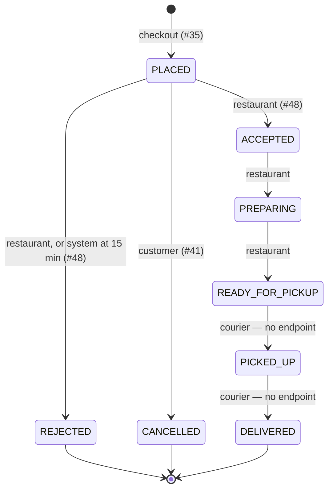
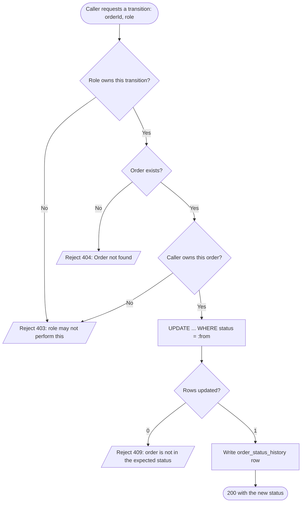
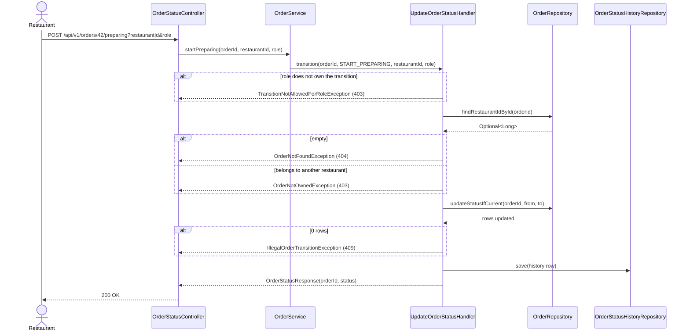

# Goal

Move an order from one status to the next, and refuse every move the lifecycle does not allow.

Issue [#47](https://github.com/msmohammed0077-cmd/mentorship-restaurant/issues/47), under the
Order Management umbrella [#34](https://github.com/msmohammed0077-cmd/mentorship-restaurant/issues/34).

## Actor

Restaurant, Customer, Courier — each owns a different set of transitions. See *Who may move what*.

## Preconditions

1. The order exists.
2. The order is not already in a terminal status.
3. The requested transition is legal from the order's current status.
4. The caller's role owns that transition.

## Scope

**This lands before anything else in the order epic.** It freezes the status vocabulary every
other ticket reads, so it also carries the schema that vocabulary lives in:

1. `orders`, `order_items` and `order_status_history`,
2. the `OrderStatus` enum and the legal-transition table,
3. the transition mechanism — a conditional update plus a history row,
4. the two restaurant transitions no other ticket owns: `preparing` and `ready_for_pickup`.

It deliberately does **not** deliver:

- **Order creation.** [#35](https://github.com/msmohammed0077-cmd/mentorship-restaurant/issues/35)
  owns checkout writing an order in `placed`. This ticket creates the tables and leaves them empty;
  its tests seed rows directly.
- **Accept and reject.** [#48](https://github.com/msmohammed0077-cmd/mentorship-restaurant/issues/48)
  owns those endpoints and the compensation path they share with cancel.
- **Cancel.** [#41](https://github.com/msmohammed0077-cmd/mentorship-restaurant/issues/41) owns it.
- **`picked_up` and `delivered`.** Defined in the enum and the transition table, but **no endpoint**.
  Courier assignment is not ticketed anywhere, so there is no authorized caller to write one for.

Each of those lands on the mechanism this ticket builds, and none of them re-implements it.

## Business Rules

1. **The vocabulary is frozen.** Eight statuses, no more. Adding one is a change to #34, not to a
   sub-issue.
2. **A transition not in the table is refused**, including a repeat of the current status.
3. **Terminal statuses do not move.** `rejected`, `cancelled` and `delivered` are final.
4. **Every transition writes a history row** — order, from, to, actor role, timestamp.
5. **The check and the write are one statement.** Reading the status and then updating it is a race;
   see *Concurrency*.

## The lifecycle



Two deliberate omissions, both decided in #47 and repeated here so they are not re-argued:

- **No `out_for_delivery`** — indistinguishable from `picked_up`.
- **No `expired`** — a 15-minute auto-reject writes `rejected` with a system reason, so expiry and
  rejection share one cleanup path instead of two.

## Who may move what

| From | To | Role | Endpoint | Owned by |
| --- | --- | --- | --- | --- |
| `PLACED` | `ACCEPTED` | RESTAURANT | `POST /orders/{id}/accept` | #48 |
| `PLACED` | `REJECTED` | RESTAURANT, SYSTEM | `POST /orders/{id}/reject` | #48 |
| `PLACED` | `CANCELLED` | CUSTOMER | `POST /orders/{id}/cancel` | #41 |
| `ACCEPTED` | `PREPARING` | RESTAURANT | `POST /orders/{id}/preparing` | **this ticket** |
| `PREPARING` | `READY_FOR_PICKUP` | RESTAURANT | `POST /orders/{id}/ready-for-pickup` | **this ticket** |
| `READY_FOR_PICKUP` | `PICKED_UP` | COURIER | — none | unticketed |
| `PICKED_UP` | `DELIVERED` | COURIER | — none | unticketed |

**A verb per transition, not one generic `PATCH /status`.** Accept carries a prep time, reject
carries a reason, and each authorizes differently. A single endpoint would have to accept the union
of every payload and branch on the target status internally.

## Where the transitions live

**A Java enum**, not a database table. Simplest, and an illegal transition fails at compile time
wherever the target is a constant. The alternative — a `transitions` table — is what you reach for
when the rules must change without a deploy. Nothing here suggests they will. Noted, not built.

```java
public enum OrderStatus {
  PLACED, ACCEPTED, REJECTED, PREPARING, READY_FOR_PICKUP, PICKED_UP, DELIVERED, CANCELLED
}
```

The transition table is a separate `OrderTransition` enum, so the statuses stay a plain vocabulary
and the rules have one home:

```java
public enum OrderTransition {
  ACCEPT(PLACED, ACCEPTED, RESTAURANT),
  REJECT(PLACED, REJECTED, RESTAURANT),
  CANCEL(PLACED, CANCELLED, CUSTOMER),
  START_PREPARING(ACCEPTED, PREPARING, RESTAURANT),
  READY(PREPARING, READY_FOR_PICKUP, RESTAURANT),
  PICK_UP(READY_FOR_PICKUP, PICKED_UP, COURIER),
  DELIVER(PICKED_UP, DELIVERED, COURIER);
}
```

`PICK_UP` and `DELIVER` are defined but reachable by no endpoint. That is deliberate: the rules are
complete, the surface is not.

## Concurrency

**A conditional update, not optimistic locking.**

```sql
UPDATE orders SET order_status = :to
WHERE order_id = :id AND order_status = :from
```

Zero rows updated means the order was not in `:from` — either someone else moved it first, or the
caller asked for a transition that is not legal from where it actually is. Both are **409**.

This needs no `version` column and no second read. Checking the status and then writing it in two
statements is a race: two restaurants' tabs both read `PLACED`, both accept, and the second write
silently wins.

**Idempotency falls out of this for free.** Accepting an already-accepted order finds no row in
`PLACED` and returns 409. That is the intended answer, not a silent success — the caller asked for
something that did not happen.

## Authorization

There is no auth in this project and this ticket does not add any. The controller takes the caller's
role as a parameter and the handler checks it against the transition's owner.

```http
POST /api/v1/orders/42/preparing?restaurantId=1&role=RESTAURANT
```

> `restaurantId` and `role` are **scoping, not authorisation**. Any caller may pass any value. This
> is a known, accepted gap, recorded rather than implied.

Two checks, and they fail differently:

- The role does not own this transition → **403**.
- The role owns it, but the restaurant does not own this order → **403**.

## Data Model

Added by this use-case (`V7`). Column names carry their table's noun, per the project rule.

**`orders`** — created here because the status column lives on it and nothing else exists yet. #35
fills it at checkout.

| Column | Type | Purpose |
| --- | --- | --- |
| `order_id` | identity PK | |
| `customer_id` | FK → `customers`, not null | |
| `restaurant_id` | FK → `restaurants`, not null | Who may accept or reject |
| `order_status` | varchar(32), not null | The frozen vocabulary |
| `order_total` | numeric(12,2), not null, `>= 0` | Snapshot at checkout |
| `order_created_at` | timestamptz, not null | |
| `order_prep_time_minutes` | integer, nullable | Captured on accept (#48). Nullable and unconsumed — it is what makes an ETA possible later, and retrofitting means a migration plus every existing order carrying a null |

**`order_items`** — the order's lines. #35 populates them; #48 reads them to restock.

| Column | Type | Purpose |
| --- | --- | --- |
| `order_item_id` | identity PK | |
| `order_id` | FK → `orders`, on delete cascade | |
| `menu_item_id` | FK → `menu_items` | What to restock |
| `order_item_name` | varchar(150), not null | Snapshot — a menu item can be renamed |
| `order_item_quantity` | integer, not null, `> 0` | |
| `order_item_price` | numeric(12,2), not null, `>= 0` | Snapshot of `cart_item_price` |
| `order_item_note` | varchar, nullable | Carried from `cart_item_note` |

**`order_status_history`** — one row per transition. #34 chose this over moving rows between tables:
a separate `order_history` table is migration risk for no gain, and every read of a delivered order
becomes a join.

| Column | Type | Purpose |
| --- | --- | --- |
| `order_status_history_id` | identity PK | |
| `order_id` | FK → `orders`, on delete cascade | |
| `order_status_history_from` | varchar(32), not null | |
| `order_status_history_to` | varchar(32), not null | |
| `order_status_history_actor_role` | varchar(32), not null | Including `SYSTEM` for the auto-reject |
| `order_status_history_at` | timestamptz, not null | |

Index: `idx_order_status_history_order_id ON order_status_history (order_id)`.

`V7` seeds nothing, so the identity-resync problem `V6` had to fix does not arise.

### Why the status columns are plain varchar

`varchar(32)` mapped `@Enumerated(EnumType.STRING)`, **no `CHECK` constraint** — the
least-resistance mapping, recorded as a decision rather than an oversight.

The trade-off accepted: the vocabulary is enforced **only in Java**. A manual `UPDATE` can write a
status the application does not know and `ddl-auto=validate` will not notice. A `CHECK` would move
that into the database for one line per vocabulary change — and since the vocabulary is frozen, that
line would likely never change again. Worth revisiting if a bad row ever appears.

## Main Success Scenario

1. Caller requests a transition on an order, passing their role.
2. System verifies the transition's owning role matches the caller's.
3. System verifies the caller owns the order.
4. System updates the status **conditionally on the expected current status**.
5. System writes an `order_status_history` row.
6. System returns the order's new status.

## Exception Flows

Each branch is labelled by the Main Flow step it extends.

- **1a. Missing or unparseable role, or an unknown order id format:** reject with 400.
- **2a. The role does not own this transition:** reject with 403 — "Role RESTAURANT may not perform
  this transition" for the mismatched case.
- **3a. The order exists but belongs to another restaurant:** reject with 403.
- **4a. The order does not exist:** reject with 404 — "Order not found".
- **4b. The conditional update matches no row:** reject with 409 — "Order is not in status
  ACCEPTED". Covers an illegal transition, a repeat of the current status, a terminal order, and a
  concurrent move, because from the database's point of view those are one thing.

## Postconditions

1. `orders.order_status` holds the new status.
2. One `order_status_history` row records the move.

## Diagram

### Flowchart



The order of the checks matters: role before existence, so a caller with the wrong role learns
nothing about which order ids exist.

### Sequence Diagram



Ownership is read with a projection rather than `findById` — the conditional update does not need a
managed entity, and loading one would go stale the moment the bulk update runs.

## Structure

```text
OrderStatusController -> OrderService (delegates only)
                      -> UpdateOrderStatusHandler  (@Service, @Transactional)
                      -> OrderRepository           (the conditional update)
                      -> OrderStatusHistoryRepository
                      -> Order / OrderItem / OrderStatusHistory  (anemic)
                      -> OrderStatusMapper         (@Component)
```

`OrderTransition` and `ActorRole` live in `order/model/entity/` beside `OrderStatus`.

Two frictions, noted rather than fixed here:

1. `order/` imports `Customer`, `Restaurant` and `MenuItem` from `cart.model.entity`. Those entities
   are not cart-specific and are in the wrong package; moving them touches the whole cart package.
2. `GlobalExceptionHandler` catches `CartException` only, so an `OrderException` base is registered
   alongside it, sharing the same body-builder. Collapsing both into one base is its own ticket.

## Testing

`UpdateOrderStatusEndpointTest`, end-to-end over HTTP, seeding orders directly — nothing creates
them until #35.

| Case | Expected |
| --- | --- |
| `ACCEPTED` → `PREPARING` by RESTAURANT | 200, status updated, one history row with from/to/actor |
| `PREPARING` → `READY_FOR_PICKUP` by RESTAURANT | 200 |
| `PLACED` → `PREPARING` (step skipped) | 409 |
| `PREPARING` → `PREPARING` (repeat of current) | 409 |
| `DELIVERED` → `PREPARING` (terminal) | 409 |
| A CUSTOMER attempting `preparing` | 403 |
| Another restaurant's order | 403 |
| Unknown order id | 404 |
| Missing `role` | 400 |
| A rejected transition writes **no** history row | history count unchanged |

The last one earns its place: a 409 that still records a transition is worse than a 409, because the
history is what every later ticket reads to explain what happened.

Cleanup deletes only the orders each test created; `order_status_history` and `order_items` follow by
cascade. `V2`, `V3` and `V6` fixtures are left intact — Flyway will not restore them.

### The test configuration this ticket had to fix first

`src/test/resources/application.properties` **shadowed** `src/main/resources/application.properties`
rather than merging — same filename, test classpath wins — so
`spring.jackson.property-naming-strategy=SNAKE_CASE` was never loaded under test. Every endpoint
test asserted camelCase while the running application served snake_case, and no test could have
caught it:

```
GET /api/v1/cart/1 -> {"id":1,"customer_id":1,"items":[{"item_name":...
```

`AddCartItemEndpointTest.rejectsAnUnknownCustomer` is the proof it mattered: it asserted 404 on a
body the real API rejects as 400, and only failed once the configuration was real.

The file is deleted; the `local` profile supplies the same datasource it already did. This lands
here rather than in a later ticket because **every ticket stacked on this one writes endpoint
tests**, and each would otherwise inherit assertions that prove nothing.

**Do not re-add that file.** If a test needs a property, put it in the main configuration.

# Notes

1. **The vocabulary is frozen by #34.** `out_for_delivery` and `expired` were considered and
   rejected there. Do not reintroduce them in a sub-issue.
2. **`picked_up` and `delivered` have no endpoint** because courier assignment is not ticketed. The
   transition table is complete; the HTTP surface is not.
3. **Role and `restaurantId` are scoping, not authorisation.** Any caller may pass any value.
4. **A 409 is the answer to four different situations** — illegal transition, repeat, terminal
   order, concurrent move. They are indistinguishable at the database and the client's next step is
   the same in all four: re-read the order.
5. **`order_prep_time_minutes` is created here but written by #48.** Nullable and unconsumed. Adding
   it now avoids a migration later plus a backfill of nulls across every existing order.
