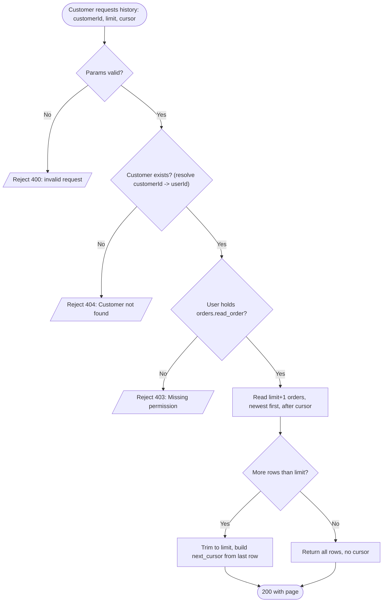
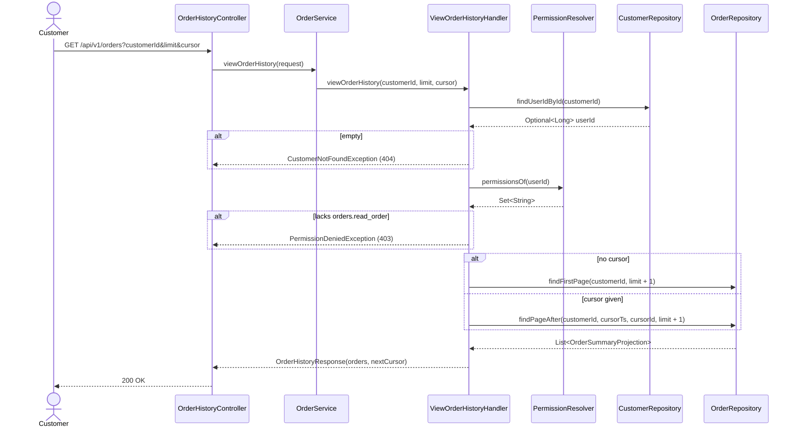

# Goal

Show a customer the orders they have placed, newest first.

Issue [#37](https://github.com/msmohammed0077-cmd/mentorship-restaurant/issues/37), under the
Order Management umbrella [#34](https://github.com/msmohammed0077-cmd/mentorship-restaurant/issues/34).

## Actor

Customer

## Preconditions

1. The customer exists.
2. The user behind that customer holds the `orders.read_order` permission.

## Scope

`GET /api/v1/orders` — one page of a customer's history, keyset-paginated, newest first.

It builds on what is already there and adds no schema:

- `orders` and `order_items` come from [#47](https://github.com/msmohammed0077-cmd/mentorship-restaurant/issues/47).
- Orders are created at checkout by [#35](https://github.com/msmohammed0077-cmd/mentorship-restaurant/issues/35).
  Until that lands, nothing populates the list and these tests seed rows directly.
- The statuses shown are #47's frozen vocabulary. This use-case reads them and never writes one.

Two deviations from the issue text, both agreed:

- **No filters.** The issue asks for filters; the reference product has none in its order history.
  Dropped rather than deferred. If one is ever wanted it arrives with its own justification.
- **Not blocked on auth.** The issue was filed as blocked because `SecurityConfig` is `permitAll`.
  It is unblocked by mimicking the principal — see *Permissions*.

## Business Rules

1. Orders are returned **newest first**, ordered by `(order_created_at DESC, order_id DESC)`.
2. A customer sees **only their own orders**.
3. A customer with no orders is **not an error**.
4. **Reads do not validate business state.** This reports what exists; it never fails because the
   world moved on.

## Permissions

Authentication does not exist and this ticket does not add it. It mimics the **seam**, not the
storage.

The intended end state is `user -> many roles -> many permissions`, resolved once at login and
cached in Redis so later requests need no database call. None of that is built. What is built is the
question the handler asks:

```java
interface PermissionResolver {
  Set<String> permissionsOf(Long userId);
}
```

Permissions hang off the **user**, not the customer — a customer is one role a user plays, and the
same user may later be a restaurant too. The handler resolves `customerId -> userId` with a
projection that answers both questions in one query:

```java
Optional<Long> findUserIdById(Long customerId);   // CustomerRepository
```

An empty result *is* the "customer does not exist" answer, so no separate `existsById` call is
needed and no entity enters scope.

The only implementation is a stub reading a configured map, **keyed by user id**. This project
configures with `.properties`, not YAML:

```properties
# src/main/resources/application.properties
app.permissions.1=orders.read_order
app.permissions.2=orders.read_order
```

A user id absent from the map holds nothing — which is what makes the 403 path reachable without a
fixture of its own.

> `customerId` in the query string is **scoping, not authorisation**. Until auth exists, any caller
> may pass any `customerId`. A known, accepted gap, recorded rather than implied.

### Why this differs from its sibling endpoints — deliberately

#47's and #48's endpoints take a `role` parameter, as #34 prescribes. This one asks a
`PermissionResolver` instead. **That is a deliberate choice, not an oversight**: the resolver is the
shape the eventual RBAC has, so when it arrives the implementation is swapped behind the interface
and no caller changes. The cost is that the order package carries two authorisation mechanisms until
the others are migrated to the resolver. Worth its own ticket.

## API

```http
GET /api/v1/orders?customerId=2&limit=20&cursor=<opaque>
```

| Parameter | Rule |
| --- | --- |
| `customerId` | required |
| `limit` | 1..50, defaults to 20 |
| `cursor` | optional; opaque, taken verbatim from a previous `next_cursor` |

```json
{
  "orders": [
    {
      "order_id": 42,
      "status": "PLACED",
      "restaurant_name": "Nile Kitchen",
      "item_count": 3,
      "total": 184.50,
      "created_at": "2026-09-07T10:12:33Z"
    }
  ],
  "next_cursor": "MTc1NzIzNDc1MzAwMHw0Mg=="
}
```

The API is **snake_case**. Java fields stay camelCase and Jackson renames them. `next_cursor` is
**absent** on the last page rather than null.

Rows are **summaries**. Line items are not included — a history list is a list, and the detail view
is [#36](https://github.com/msmohammed0077-cmd/mentorship-restaurant/issues/36). `item_count` comes
from a count projection, not from loading the lines.

## Paging

Keyset, not offset. Order history is append-heavy and read newest-first, which is exactly where
offset drifts: an order placed mid-scroll shifts every later row down a page, so the reader sees one
row twice and never sees another.

The first page and later pages are **two separate queries**, not one query with a nullable cursor.
Postgres cannot infer a type for a bare `:param is null` placeholder and fails the statement
outright:

```text
ERROR: could not determine data type of parameter $2
```

Splitting also keeps each statement on the index without an `OR` in the way:

```sql
-- first page
WHERE customer_id = :customerId
ORDER BY order_created_at DESC, order_id DESC
LIMIT :limit

-- pages after a cursor
WHERE customer_id = :customerId
  AND (order_created_at < :cursorTs
       OR (order_created_at = :cursorTs AND order_id < :cursorId))
ORDER BY order_created_at DESC, order_id DESC
LIMIT :limit
```

The row-value comparison is written out as an `OR` because HQL has no tuple comparison.

The cursor is composite because `order_created_at` is not unique — two orders can share a timestamp,
and `order_id` is what keeps the page boundary stable when they do. It is base64 of
`<epochMillis>|<orderId>`, opaque so clients cannot construct one and depend on its shape. It is not
a secret and not signed.

`limit + 1` rows are read, so the last page is detected without a second count query.

The cost, accepted: **no total count and no page numbers.** Keyset paging cannot cheaply produce
either.

## Data Model

**None added.** `orders` and `order_items` come from #47.

One index is worth naming because this use-case is why it exists:

```sql
idx_orders_customer_created ON orders (customer_id, order_created_at DESC, order_id DESC)
```

That is the keyset query's exact access path.

## Main Success Scenario

1. Customer requests their history, optionally with a page size and a cursor.
2. System resolves the customer to a user, which also proves the customer exists.
3. System verifies that user holds `orders.read_order`.
4. System reads one page, newest first, starting after the cursor if given.
5. System returns the page and a cursor for the next one, or nothing if this was the last.

## Exception Flows

- **1a. `customerId` missing, `limit` outside 1..50, or `cursor` malformed:** 400. Shape and range
  are rejected by validation before the handler runs.
- **2a. Customer does not exist:** 404 — "Customer not found".
- **3a. The customer's user lacks `orders.read_order`:** 403 — "Missing permission: orders.read_order".
- **4a. Customer has no orders:** not an exception. 200, an empty list, no cursor.

## Postconditions

None. This is a read.

## Diagram

### Flowchart



### Sequence Diagram



## Structure

```text
OrderHistoryController -> OrderService (delegates only)
                       -> ViewOrderHistoryHandler  (@Service, @Transactional(readOnly = true))
                       -> OrderRepository          (the two keyset queries)
                       -> OrderMapper              (@Component)
```

`PermissionResolver` and `PermissionDeniedException` live in a `permission/` package. They are not
an order concern, and every later ticket asks the same question.

A separate controller from `OrderStatusController`: that one owns transitions, this one owns a read.

## Testing

`ViewOrderHistoryEndpointTest`, end-to-end, seeding orders directly — nothing creates them until #35.

| Case | Expected |
| --- | --- |
| Happy path | 200, newest first, summary fields correct |
| Another customer's orders | not shown |
| `limit` below the result count | cursor present; following it yields the next page with no overlap and no gap |
| Last page | no cursor |
| **Two orders sharing `order_created_at`** | ordering falls to `order_id DESC` and stays stable across the page boundary |
| Customer with no orders | 200, empty, no cursor |
| Customer whose user lacks the permission | 403 |
| Unknown `customerId` | 404 |
| `limit=0`, `limit=51`, malformed `cursor` | 400 |

The equal-timestamp case gets its own test because it is the entire reason the cursor is composite.

Cleanup deletes only the orders each test created; `order_items` follows by cascade.

# Notes

1. **No filters, by decision.** See *Scope*.
2. **`customerId` is scoping, not authorisation.** See *Permissions*.
3. **This endpoint authorises differently from its siblings**, deliberately. See *Permissions*.
4. **No total count.** Keyset paging cannot cheaply produce one, so there is no `total_elements` or
   page count. A client needing "you have placed N orders" needs a separate counted endpoint.
5. **Nothing here writes a status.** The vocabulary is #47's and this use-case only reads it.
