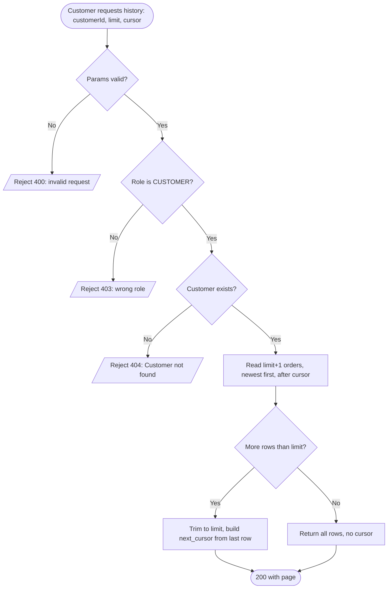
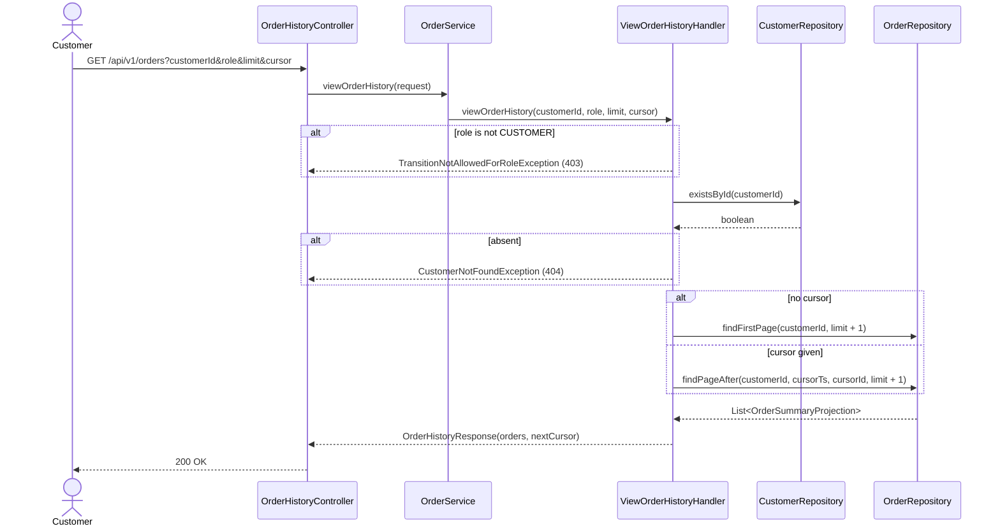

# Goal

Show a customer the orders they have placed, newest first.

Issue [#37](https://github.com/msmohammed0077-cmd/mentorship-restaurant/issues/37), under the
Order Management umbrella [#34](https://github.com/msmohammed0077-cmd/mentorship-restaurant/issues/34).

## Actor

Customer

## Preconditions

1. The customer exists.
2. The caller's role is `CUSTOMER`.

## Scope

`GET /api/v1/orders` — one page of a customer's history, keyset-paginated, newest first.

It builds on what is already there and adds no schema:

- `orders` and `order_items` come from [#47](https://github.com/msmohammed0077-cmd/mentorship-restaurant/issues/47).
- Orders are created at checkout by [#35](https://github.com/msmohammed0077-cmd/mentorship-restaurant/issues/35).
  Until that lands, nothing populates the list and these tests seed rows directly.
- The statuses shown are #47's frozen vocabulary. This use-case reads them and never writes one.

Two deviations from the issue text, both agreed:

- **No filters.** The issue asks for filters; the reference product has none in its order history.
  Dropped rather than deferred. If one is ever wanted it arrives with its own justification.
- **Not blocked on auth.** The issue was filed as blocked because `SecurityConfig` is `permitAll`.
  It is unblocked by mimicking the principal — see *Permissions*.

## Business Rules

1. Orders are returned **newest first**, ordered by `(order_created_at DESC, order_id DESC)`.
2. A customer sees **only their own orders**.
3. A customer with no orders is **not an error**.
4. **Reads do not validate business state.** This reports what exists; it never fails because the
   world moved on.

## Authorisation

There is no auth in this project and this ticket does not add any, per #34. The caller passes a role
and the handler checks it, exactly as #47's and #48's endpoints do.

```http
GET /api/v1/orders?customerId=2&role=CUSTOMER&limit=20
```

A role other than `CUSTOMER` is refused with 403.

`customerId` and `role` are **untrusted, caller-supplied inputs**, because `SecurityConfig` is
`permitAll` and there is no principal to derive them from. `role` is still checked, and a customer
sees only the orders belonging to the `customerId` given — `showsNoOtherCustomersOrders` holds that
line.

What is missing is **authentication**, not authorisation: nothing stops a caller supplying someone
else's `customerId` and reading their history. That is the textbook IDOR shape, it is #34's accepted
trade, and it must be closed before this reaches a real environment — tracked against #23, not
deferred silently.

### The `PermissionResolver` that was here, and why it went

An earlier version of this use-case authorised through a `PermissionResolver` seam — the shape the
eventual RBAC has (`user -> roles -> permissions`, resolved at login and cached in Redis) — on the
grounds that the implementation could later be swapped behind the interface with no caller change.

Code review killed it, correctly. The interface is the right shape, but:

- **#34 froze "role as a parameter, do not build auth"**, and this is a sub-issue.
- **#37 never asked for a 403 at all.**
- The stub **denied by default**: only users 1 and 2 were configured, so every customer #35 creates
  would have received 403 on their own order history, fixable only by editing production
  configuration. A permission gate that has to be hand-fed is not a stand-in, it is an outage.
- It left two authorisation mechanisms in one package, with no ticket number for reconciling them.

The seam belongs in **its own ticket**, migrating #47, #48 and #37 together and choosing a default
that does not lock real customers out.

## API

```http
GET /api/v1/orders?customerId=2&role=CUSTOMER&limit=20
    &cursor.createdAt=2026-09-05T09:00:00.123456Z&cursor.orderId=42
```

| Parameter | Rule |
| --- | --- |
| `customerId` | required |
| `limit` | 1..50, defaults to 20 |
| `cursor.createdAt` | optional ISO-8601 timestamp; supply with `cursor.orderId` or neither |
| `cursor.orderId` | optional; supply with `cursor.createdAt` or neither |

```json
{
  "orders": [
    {
      "order_id": 42,
      "status": "PLACED",
      "restaurant_name": "Nile Kitchen",
      "item_count": 3,
      "total": 184.50,
      "created_at": "2026-09-07T10:12:33Z"
    }
  ],
  "next_cursor": { "created_at": "2026-09-05T09:00:00.123456Z", "order_id": 42 }
}
```

The API is **snake_case**. Java fields stay camelCase and Jackson renames them. `next_cursor` is
**absent** on the last page rather than null.

**The queries return the response DTO directly.** Spring Data rewrites the constructor expression,
so there is no projection interface and no mapper — the repository names a response class, which is
the cost of removing that layer. The `limit + 1` read, the trim and the "is there another page"
answer live in a reusable `KeysetPage<T>`, since every future keyset endpoint repeats them.

Rows are **summaries**. Line items are not included — a history list is a list, and the detail view
is [#36](https://github.com/msmohammed0077-cmd/mentorship-restaurant/issues/36). `item_count` comes
from a count projection, not from loading the lines.

## Paging

Keyset, not offset. Order history is append-heavy and read newest-first, which is exactly where
offset drifts: an order placed mid-scroll shifts every later row down a page, so the reader sees one
row twice and never sees another.

The first page and later pages are **two separate queries**, not one query with a nullable cursor.
Postgres cannot infer a type for a bare `:param is null` placeholder and fails the statement
outright:

```text
ERROR: could not determine data type of parameter $2
```

Splitting also keeps each statement on the index without an `OR` in the way:

```sql
-- first page
WHERE customer_id = :customerId
ORDER BY order_created_at DESC, order_id DESC
LIMIT :limit

-- pages after a cursor
WHERE customer_id = :customerId
  AND (order_created_at < :cursorTs
       OR (order_created_at = :cursorTs AND order_id < :cursorId))
ORDER BY order_created_at DESC, order_id DESC
LIMIT :limit
```

The row-value comparison is written out as an `OR` because HQL has no tuple comparison.

The cursor is composite because `order_created_at` is not unique — two orders can share a
timestamp, and `order_id` is what keeps the page boundary stable when they do.

**It is a plain object, not an encoded string.** An earlier version base64-encoded
`<epochMillis>|<orderId>`, on the argument that opacity stops clients coupling to the sort key. It
was not worth it: the encoding caused two of this use-case's blocking bugs — a millisecond rounding
that silently skipped every order sharing a millisecond with the boundary row, and hostile values
that reached the SQL bind as 500s. An ISO-8601 timestamp cannot lose precision, and Spring does the
parsing.

The trade accepted: **the sort key is now public API.** Changing it later is a breaking change for
clients, where an opaque cursor could have been changed freely.

Validation stays, because the values are still caller-supplied: half a cursor is a 400, and a
timestamp outside year 1–9999 is a 400 rather than a 500 from Postgres.

`limit + 1` rows are read, so the last page is detected without a second count query.

The cost, accepted: **no total count and no page numbers.** Keyset paging cannot cheaply produce
either.

## Data Model

**None added.** `orders` and `order_items` come from #47.

One index is worth naming because this use-case is why it exists:

```sql
idx_orders_customer_created ON orders (customer_id, order_created_at DESC, order_id DESC)
```

That is the keyset query's exact access path. It is created by `V7` alongside the table — review
found the spec had claimed it while no migration created it, so both queries were seq-scanning.

## Main Success Scenario

1. Customer requests their history, optionally with a page size and a cursor.
2. System verifies the role is `CUSTOMER`, then that the customer exists.
4. System reads one page, newest first, starting after the cursor if given.
5. System returns the page and a cursor for the next one, or nothing if this was the last.

## Exception Flows

- **1a. `customerId` or `role` missing, `limit` outside 1..50, or `cursor` malformed:** 400. Shape
  and range are rejected by validation before the handler runs. `limit` is also `@NotNull`: an empty
  `?limit=` binds null *over* the field default and null passes `@Min`/`@Max`, which used to reach
  `limit + 1` and 500.
- **2a. Customer does not exist:** 404 — "Customer not found".
- **2b. The role is not `CUSTOMER`:** 403. Checked before existence, so a caller with the wrong role
  learns nothing about which customer ids exist.
- **4a. Customer has no orders:** not an exception. 200, an empty list, no cursor.

## Postconditions

None. This is a read.

## Diagram

### Flowchart



### Sequence Diagram



## Structure

```text
OrderHistoryController -> OrderService (delegates only)
                       -> ViewOrderHistoryHandler  (@Service, @Transactional(readOnly = true))
                       -> OrderRepository          (the two keyset queries)
                       -> KeysetPage<T>            (limit + 1, trim, hasMore)
```

A separate controller from `OrderStatusController`: that one owns transitions, this one owns a read.

## Testing

`ViewOrderHistoryEndpointTest`, end-to-end, seeding orders directly — nothing creates them until #35.

| Case | Expected |
| --- | --- |
| Happy path | 200, newest first, summary fields correct |
| Another customer's orders | not shown |
| `limit` below the result count | cursor present; following it yields the next page with no overlap and no gap |
| Last page | no cursor |
| **Two orders sharing `order_created_at`** | ordering falls to `order_id DESC` and stays stable across the page boundary |
| Customer with no orders | 200, empty, no cursor |
| A role other than `CUSTOMER` | 403 |
| Missing `role` | 400 |
| **Two orders inside one millisecond** | neither is skipped across the page boundary |
| A cursor whose timestamp is out of range | 400, not 500 |
| Half a cursor (id without timestamp) | 400 |
| An unparseable cursor timestamp | 400 |
| `?limit=` (empty) | 400, not 500 |
| Unknown `customerId` | 404 |
| `limit=0`, `limit=51`, malformed `cursor` | 400 |

The equal-timestamp case gets its own test because it is the entire reason the cursor is composite.

Cleanup deletes only the orders each test created; `order_items` follows by cascade.

# Notes

1. **No filters, by decision.** See *Scope*.
2. **`customerId` and `role` are untrusted inputs, and reading another customer's history is an
   IDOR that authentication has to close.** See *Authorisation*.
3. **The `PermissionResolver` seam was removed after review.** See *Authorisation* — it belongs in
   its own ticket, with a default that does not lock real customers out.
4. **No total count.** Keyset paging cannot cheaply produce one, so there is no `total_elements` or
   page count. A client needing "you have placed N orders" needs a separate counted endpoint.
5. **Nothing here writes a status.** The vocabulary is #47's and this use-case only reads it.
