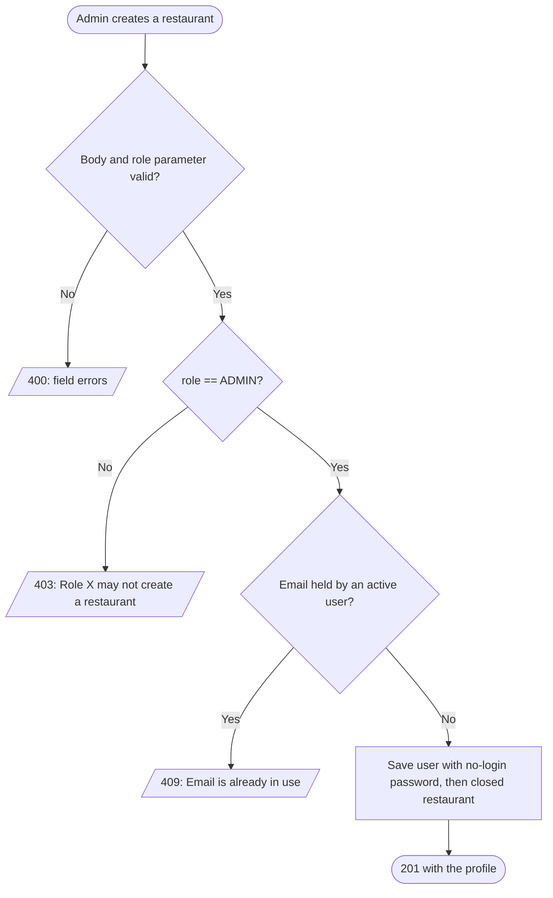
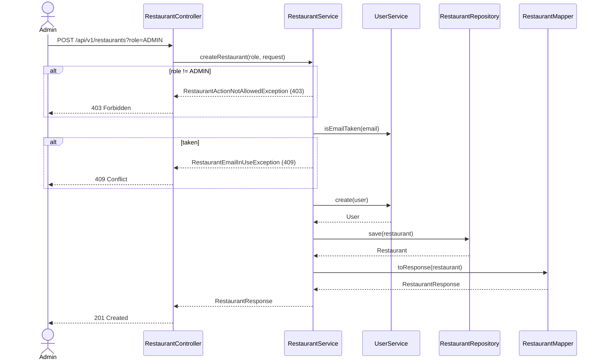

# Goal

The System Admin adds a restaurant to the platform, with the account it will later log in with.

Issue [#86](https://github.com/msmohammed0077-cmd/mentorship-restaurant/issues/86), under the
Restaurant CRUD umbrella [#85](https://github.com/msmohammed0077-cmd/mentorship-restaurant/issues/85).
Design: [restaurant CRUD](../../../designs/2026-10-10-restaurant-crud-design.md).

## Actor

System Admin (`?role=ADMIN`).

## Preconditions

No active user, customer or restaurant, holds the email.

## Scope

`POST /api/v1/restaurants?role=ADMIN` — **201** with the new restaurant's profile.

Adds `CreateRestaurantRequest`, `RestaurantService.createRestaurant`, `UserService.NO_LOGIN_PASSWORD`,
`RestaurantActionNotAllowedException` (403) and `RestaurantEmailInUseException` (409). `Restaurant`
gains a builder (ADR 0005). `ActorRole` moves to `user/model/` and gains `ADMIN`.

## Business Rules

1. Only **`ADMIN`** may create a restaurant. Any other role is refused with 403, "Role X may not
   create a restaurant", **before** the database is read, so a refused caller cannot learn which
   emails are taken.
2. The **email** is lower-cased, and must not be held by an **active** user of either kind,
   compared case-insensitively — 409, "Email is already in use". A soft-deleted user's email
   is free. The partial unique index `uq_users_active_email` is the backstop.
3. The **name** is stored twice: as the restaurant's name and as its user's name. It is capped at
   150 characters, `user_name`'s limit.
4. The account has **no usable password**: `user_password` is `UserService.NO_LOGIN_PASSWORD`
   (`"!no-login"`), which is not a BCrypt hash, so no password matches it. The constant marks the
   accounts real authentication must give a password.
5. A new restaurant **starts closed** (`is_open: false`): it has no menu yet, and the owner opens it
   when ready. An `is_open` in the body is ignored. The column's `DEFAULT TRUE` stays for the seeds.
6. The password is **never** in the response.

## Authorisation

Trust-based: the caller declares `?role=` and the service believes it. Anyone can claim `ADMIN`
and create restaurants — an IDOR that closes with real authentication,
[#83](https://github.com/msmohammed0077-cmd/mentorship-restaurant/issues/83).

## API

```http
POST /api/v1/restaurants?role=ADMIN
Content-Type: application/json

{
  "name": "Koshary Corner",
  "description": "Koshary, the Cairo way.",
  "email": "contact@koshary.example.com"
}
```

| Field | Rule |
| --- | --- |
| `name` | required, not blank, max 150 |
| `description` | optional |
| `email` | required, valid email, max 255 |

Response, **201**:

```json
{
  "restaurant_id": 4,
  "name": "Koshary Corner",
  "description": "Koshary, the Cairo way.",
  "email": "contact@koshary.example.com",
  "is_open": false
}
```

## Data Model

No migration. One `users` row and one `restaurants` row:

| Table | Column | Value |
| --- | --- | --- |
| `users` | `user_name` | the name |
| `users` | `user_email` | the email, lower-cased |
| `users` | `user_password` | `"!no-login"` |
| `restaurants` | `user_id` | the new user |
| `restaurants` | `restaurant_name` | the name |
| `restaurants` | `restaurant_description` | the description, or null |
| `restaurants` | `restaurant_is_open` | `false` |

Not stored: phone, address, opening hours. `is_open` stays a manual flag.

## Main Success Scenario

1. The admin sends the restaurant's name, description and email with `?role=ADMIN`.
2. The system validates the body (400 before the service runs).
3. The system checks the role.
4. The system normalises the email and checks no active user holds it.
5. The system saves the user, then the restaurant, closed.
6. The system returns 201 with the profile.

## Exception Flows

- **1a. `role` missing or not a role:** 400, "role is required" / "role is not a valid value".
- **2a. Body invalid:** 400, naming each failing field.
- **3a. Role is not `ADMIN`:** 403, "Role X may not create a restaurant". Nothing is read or written.
- **4a. Email held by an active user:** 409, "Email is already in use".

## Postconditions

A closed restaurant exists, listed by the index and readable by id, with an account no one can log
in to yet.

## Diagram

### Flowchart



### Sequence Diagram



## Testing

`CreateRestaurantEndpointTest`, end-to-end.

| Case | Expected |
| --- | --- |
| Admin, full body, mixed-case email, `is_open: true` in the body | 201, email normalised, `is_open: false`, no `password`; stored `user_name` = `restaurant_name`, `user_password` = `!no-login` |
| No description | 201, no `description` |
| `CUSTOMER`, `RESTAURANT`, `COURIER`, `SYSTEM` | 403, nothing written |
| `CUSTOMER` with a taken email | 403, not 409 |
| No `role` / unknown `role` | 400 |
| Blank name, name of 151, no email, malformed email, email over 255 | 400 naming the field |
| Seeded restaurant's email, upper-cased | 409 |
| Seeded customer's email | 409 |
| Email of a soft-deleted restaurant | 201 |

Every email the test creates starts with `create.restaurant.test.`; cleanup deletes only those users,
and their restaurants go with them by cascade.

# Notes

1. **Two simultaneous creates with the same email** both pass the check; the second then hits
   `uq_users_active_email` and answers 500. Create-customer accepts the same race.
2. **No phone, address or opening hours.** No client needs them yet.
3. **The owner's first login** belongs to #83, which replaces the `NO_LOGIN_PASSWORD` marker with a
   real password.
4. **Surrounding whitespace in the email is a 400, not trimmed.** `@Email` refuses it before the
   service runs; the service's `trim()` mirrors create-customer and never changes anything over HTTP.
