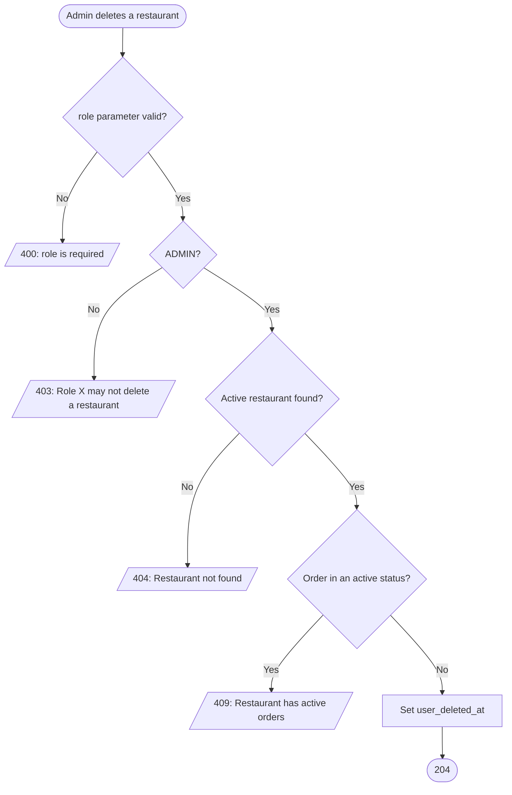
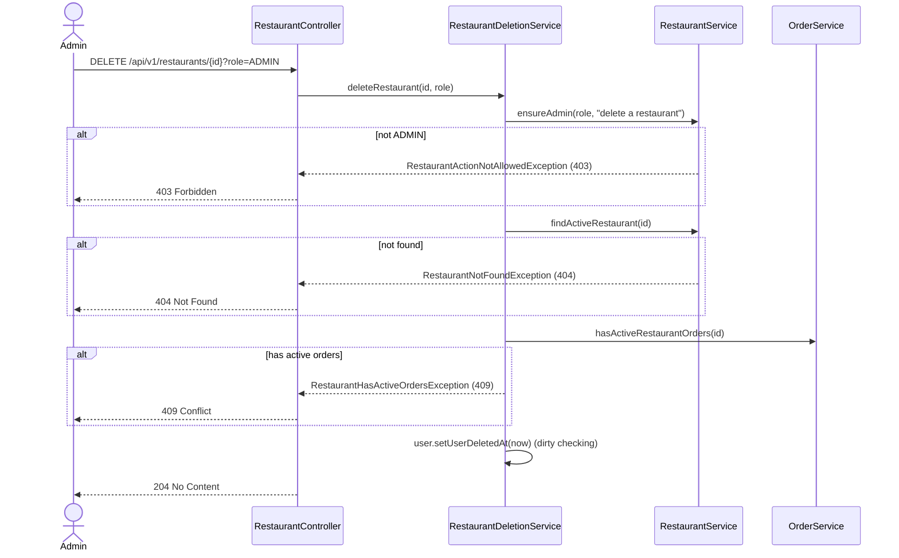

# Goal

The System Admin removes a restaurant from the platform.

Issue [#90](https://github.com/msmohammed0077-cmd/mentorship-restaurant/issues/90), under the
Restaurant CRUD umbrella [#85](https://github.com/msmohammed0077-cmd/mentorship-restaurant/issues/85).
Design: [restaurant CRUD](../../../designs/2026-10-10-restaurant-crud-design.md).

## Actor

System Admin (`?role=ADMIN`).

## Preconditions

The restaurant exists, is not deleted, and has no order in flight.

## Scope

`DELETE /api/v1/restaurants/{id}?role=ADMIN` — **204**, no body.

Adds `RestaurantDeletionService.deleteRestaurant`, `OrderService.hasActiveRestaurantOrders` and
`RestaurantHasActiveOrdersException`. `RestaurantService.findMenuItem` now refuses a deleted
restaurant's items.

## Business Rules

1. Only **`ADMIN`** may delete a restaurant. Anything else, the restaurant itself included, is 403,
   "Role X may not delete a restaurant", **before** the database is read.
2. A **soft delete**: the restaurant's user gets `user_deleted_at`. Nothing is removed.
3. A restaurant with an order in an **active status** (`PLACED` through `PICKED_UP`) cannot be
   deleted: 409, "Restaurant has active orders". Delivered, rejected and cancelled orders do not
   block it.
4. **Afterwards it does not exist to the API:** details, edit, open and delete answer 404,
   "Restaurant not found"; the index leaves it out; adding its items to a cart is 404, "Item not
   found"; checkout of a cart holding its items is 404, "Restaurant not found".
5. **Kept:** past orders, ratings, menus, menu items and carts' lines. A customer's order history
   still shows past orders with the restaurant's name, and a delivered order can still be rated.
6. Its **email is freed**: a new restaurant or customer may register it.

## Authorisation

Trust-based: the caller declares `?role=ADMIN` and the service believes it. Anyone can claim to be
the admin and delete any restaurant — an IDOR that closes with real authentication,
[#83](https://github.com/msmohammed0077-cmd/mentorship-restaurant/issues/83).

## API

```http
DELETE /api/v1/restaurants/4?role=ADMIN
```

Response, **204**, no body.

## Data Model

No migration. Writes `users.user_deleted_at` for the restaurant's user. The partial unique index
`uq_users_active_email` covers active users only, which is what frees the email.

## Main Success Scenario

1. The admin sends the restaurant's id with `role=ADMIN`.
2. The system checks the role.
3. The system loads the active restaurant.
4. The system checks it has no active order.
5. The system marks its user deleted and returns 204.

## Exception Flows

- **1a. `role` missing or not a role:** 400, "role is required" / "role is not a valid value".
- **2a. Not `ADMIN`:** 403, "Role X may not delete a restaurant". Nothing is read or written.
- **3a. Restaurant unknown or already deleted:** 404, "Restaurant not found". Deleting twice is 404
  the second time.
- **4a. An order is in flight:** 409, "Restaurant has active orders". Nothing is written.

## Postconditions

The restaurant is soft-deleted and gone from every restaurant endpoint; its items can no longer be
added to a cart or checked out; its email is free.

## Diagram

### Flowchart



### Sequence Diagram



## Testing

`DeleteRestaurantEndpointTest`, end-to-end; `AddCartItemEndpointTest` and `CreateOrderEndpointTest`
for the paths afterwards.

| Case | Expected |
| --- | --- |
| Admin deletes | 204, soft-deleted; a second delete is 404 |
| Details afterwards | 404 |
| Its email, for a new restaurant | 201 |
| Only a `DELIVERED` order | 204 |
| A `PLACED` order | 409, not deleted |
| `CUSTOMER`, `RESTAURANT`, `COURIER`, `SYSTEM` | 403, not deleted |
| `RESTAURANT` with its own id | 403 |
| `CUSTOMER` on an unknown id | 403, not 404 |
| Unknown id | 404 |
| No `role` | 400 |
| Add a deleted restaurant's item to a cart | 404, "Item not found" |
| Checkout of a cart holding a deleted restaurant's item | 404, "Restaurant not found"; cart kept, no order |

# Notes

1. **Its own service.** The active-order check needs `OrderService`, and order (checkout) and cart
   already need `RestaurantService`; inside it, the check would close an injection cycle. Same
   shape as `CustomerDeletionService`.
2. **Accepted race:** an order placed between the active-order check and the commit. After the
   commit, checkout refuses.
3. **Menus are not yet guarded.** Menu endpoints refusing a deleted restaurant's menus belong to
   the menu CRUD, [#92](https://github.com/msmohammed0077-cmd/mentorship-restaurant/issues/92).
