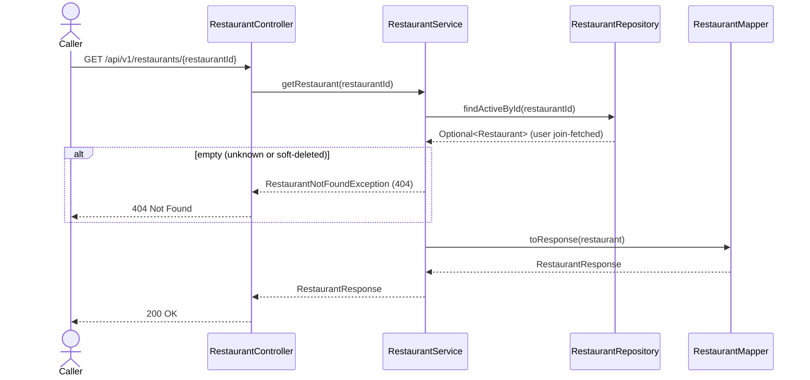

# Goal

Read one restaurant's profile by id.

Issue [#89](https://github.com/msmohammed0077-cmd/mentorship-restaurant/issues/89), under the
Restaurant CRUD umbrella [#85](https://github.com/msmohammed0077-cmd/mentorship-restaurant/issues/85).
Design: [restaurant CRUD](../../../designs/2026-10-10-restaurant-crud-design.md).

## Actor

Any caller. Reads take no role parameter (see *Authorisation*).

## Preconditions

None beyond the restaurant existing and not being soft-deleted.

## Scope

`GET /api/v1/restaurants/{restaurantId}` — **200** with the restaurant's profile.

Adds `RestaurantController`, `RestaurantRepository.findActiveById`, `RestaurantMapper`,
`RestaurantResponse` and `RestaurantService.getRestaurant`. The create, edit, open and delete
endpoints build on them.

## Business Rules

1. An **unknown or soft-deleted** restaurant is refused with 404, "Restaurant not found".
   Soft-deleted restaurants do not exist to the API: the lookup is
   `RestaurantRepository.findActiveById`, which filters `user.userDeletedAt is null`.
2. The password is **never** in the response.
3. **Read-only.** A closed restaurant is reported (`is_open: false`), not refused.
4. **Menus are not embedded.** They belong to the menu CRUD
   ([#96](https://github.com/msmohammed0077-cmd/mentorship-restaurant/issues/96)).

## Authorisation

None. A restaurant's profile, contact email included, is public directory information, so there
is no IDOR to close here. The write endpoints check a declared role; real authentication is
[#83](https://github.com/msmohammed0077-cmd/mentorship-restaurant/issues/83).

## API

```http
GET /api/v1/restaurants/1
```

Response, **200**:

```json
{
  "restaurant_id": 1,
  "name": "Nile Kitchen",
  "description": "Modern Egyptian and Mediterranean dishes.",
  "email": "contact@nilekitchen.example.com",
  "is_open": true
}
```

The API is snake_case (global Jackson setting). `email` is the restaurant's login email on
`users`, used as its contact email.

## Data Access

```java
@Query("""
    select restaurant from Restaurant restaurant
    join fetch restaurant.user user
    where restaurant.id = :restaurantId and user.userDeletedAt is null
    """)
Optional<Restaurant> findActiveById(Long restaurantId);
```

**Why join-fetch:** `Restaurant.user` is `LAZY`, `spring.jpa.open-in-view` is `false`, and the
email lives on `users`. The fetch join loads both in one statement, and the soft-delete filter rides
on the same join.

## Main Success Scenario

1. The caller requests a restaurant by id.
2. The system loads the restaurant and its user, excluding soft-deleted users.
3. The system returns 200 with the profile.

## Exception Flows

- **1a. Id is not a number:** 400 (type mismatch, before the service runs).
- **2a. No active restaurant with that id:** 404, "Restaurant not found".

## Postconditions

Nothing changes.

## Diagram

### Sequence Diagram



## Testing

`GetRestaurantEndpointTest`, end-to-end.

| Case | Expected |
| --- | --- |
| Seeded restaurant 1 | 200, name `Nile Kitchen`, its email, `is_open: true`, no `password`, no `menus` |
| Closed restaurant (inserted via SQL) | 200, `is_open: false` |
| Unknown id `999999` | 404, "Restaurant not found" |
| Soft-deleted restaurant (inserted, then marked deleted via SQL) | 404, "Restaurant not found" |

Every email the test creates starts with `get.restaurant.test.`, and cleanup deletes only those
users; their `restaurants` rows go with them by cascade. Seeded restaurants are only read.

# Notes

1. **No menus in the profile.** See rule 4.
2. **Soft delete is filtered from the start**, so the delete use-case (#90) does not revisit this
   read.
