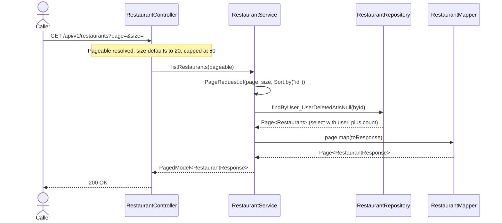

# Goal

Browse the restaurant directory a page at a time.

Issue [#88](https://github.com/msmohammed0077-cmd/mentorship-restaurant/issues/88), under the
Restaurant CRUD umbrella [#85](https://github.com/msmohammed0077-cmd/mentorship-restaurant/issues/85).
Design: [restaurant CRUD](../../../designs/2026-10-10-restaurant-crud-design.md).

## Actor

Any caller. Reads take no role parameter.

## Preconditions

None.

## Scope

`GET /api/v1/restaurants?page=0&size=20` — **200** with one page of restaurants and its metadata.

Builds on [get-restaurant](../get-restaurant/get-restaurant.md) (`RestaurantController`,
`RestaurantMapper`, `RestaurantResponse`). Adds `RestaurantRepository.findByUser_UserDeletedAtIsNull`,
`RestaurantService.listRestaurants` and `spring.data.web.pageable.max-page-size`.

## Business Rules

1. **Soft-deleted restaurants are not listed.**
2. **Open and closed alike.** There is no `?open=` filter until a client needs one.
3. **Order is id ascending, always.** A client's `?sort=` is ignored: the service rebuilds the
   request as `PageRequest.of(page, size, Sort.by("id"))`.
4. **Paging is clamped, never rejected.** `size` defaults to 20 and is capped at 50
   (`spring.data.web.pageable.max-page-size`; order history has the same cap but rejects a larger
   `limit` with 400); `size=500` returns a page of 50. A negative `page` is page 0. A page past the
   end is 200 with empty `content`. A `page` so large that page × size overflows an `int` is
   clamped to the last page that does not, which `page.number` reports.
5. The password is **never** in the response.

## Authorisation

None; the directory is public. See [get-restaurant](../get-restaurant/get-restaurant.md#authorisation).

## API

```http
GET /api/v1/restaurants?page=0&size=2
```

Response, **200**:

```json
{
  "content": [
    {
      "restaurant_id": 1,
      "name": "Nile Kitchen",
      "description": "Modern Egyptian and Mediterranean dishes.",
      "email": "contact@nilekitchen.example.com",
      "is_open": true
    },
    {
      "restaurant_id": 2,
      "name": "Burger Yard",
      "description": "Burgers, fries, and classic fast-casual meals.",
      "email": "contact@burgeryard.example.com",
      "is_open": true
    }
  ],
  "page": { "size": 2, "number": 0, "total_elements": 3, "total_pages": 2 }
}
```

The body is Spring Data's `PagedModel`. Its metadata follows the snake_case setting
(`total_elements`, `total_pages`), as `ListRestaurantsEndpointTest` asserts.

## Data Access

```java
@EntityGraph(attributePaths = "user")
Page<Restaurant> findByUser_UserDeletedAtIsNull(Pageable pageable);
```

A derived query: Spring writes the select, the `limit`/`offset` and the count query. The entity
graph fetches the user (for the email) in the same select, so a page is two statements: the rows
and the count.

## Main Success Scenario

1. The caller requests a page of restaurants.
2. Spring resolves `page` and `size`, applying the default and the cap.
3. The system loads that page of active restaurants in id order, and counts them.
4. The system returns 200 with the page and its metadata.

## Exception Flows

- **2a. `page` or `size` is not a number:** Spring falls back to the default for it; no error.

There is no other rejection: the endpoint always answers 200.

## Postconditions

Nothing changes.

## Diagram

### Sequence Diagram



## Testing

`ListRestaurantsEndpointTest`, end-to-end.

| Case | Expected |
| --- | --- |
| No parameters | 200, first row is restaurant 1, `page.size` 20, `page.number` 0, no `password` |
| Two inserted (one open, one closed), `size=1`, the last two pages | each page holds one of them, `is_open` as inserted, totals counted |
| `size=500` | `page.size` 50 |
| `page=-1` | `page.number` 0 |
| `page=50000000&size=50` | 200, empty `content`, `page.number` 42949672 |
| `sort=name,asc` with a restaurant named to sort first | ids still ascending |
| One inserted and one soft-deleted | the kept one listed, the deleted one not, total up by one |

Seeds are global and shared, so counts are relative to a baseline taken with SQL at the start of
each test, and the tests assume no more than 50 active restaurants. Every email the test creates
starts with `list.restaurants.test.`; cleanup deletes only those users.

# Notes

1. **Offset, not keyset.** The directory is small and admin-curated, and offset paging is Spring's
   end to end. See [ADR 0007](../../../decisions/0007-offset-paging-by-default.md).
2. **No `?open=` filter, no search.** Added when a client needs them.
