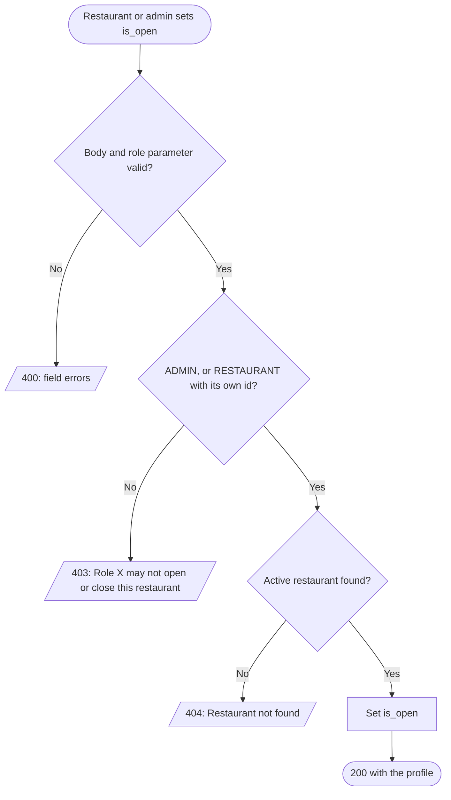
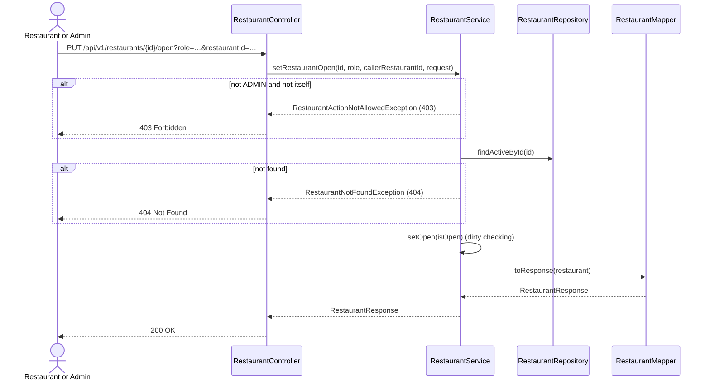

# Goal

The restaurant, or the System Admin, opens the restaurant to new orders or closes it.

Issue [#91](https://github.com/msmohammed0077-cmd/mentorship-restaurant/issues/91), under the
Restaurant CRUD umbrella [#85](https://github.com/msmohammed0077-cmd/mentorship-restaurant/issues/85).
Design: [restaurant CRUD](../../../designs/2026-10-10-restaurant-crud-design.md).

## Actor

The restaurant (`?role=RESTAURANT&restaurantId={id}`), or System Admin (`?role=ADMIN`).

## Preconditions

The restaurant exists and is not deleted.

## Scope

`PUT /api/v1/restaurants/{id}/open?role=…[&restaurantId=…]` — **200** with the profile.

Adds `SetRestaurantOpenRequest` and `RestaurantService.setRestaurantOpen`; shares
`ensureMayManage` with [update-restaurant](../update-restaurant/update-restaurant.md).

## Business Rules

1. Only **`ADMIN`**, or **`RESTAURANT`** whose `restaurantId` is the `{id}`, may open or close it.
   Anything else is 403, "Role X may not open or close this restaurant", **before** the database is
   read.
2. `is_open` is **required** (`true` or `false`).
3. **Idempotent**: setting the current value again is 200 and changes nothing.
4. **Closing stops new business only.** Add-to-cart and checkout refuse a closed restaurant (409,
   "Restaurant is closed"). Orders already placed carry on: accepted and preparing orders continue,
   and a `PLACED` order keeps its normal auto-reject deadline.
5. **Carts are kept.** A cart holding a closed restaurant's items stays; checkout refuses it until
   the restaurant reopens or the customer empties it.
6. `is_open` is a manual flag, not opening hours. See [Open (restaurant)](../../../glossary.md).

## Authorisation

Trust-based: the caller declares `?role=` and `?restaurantId=`, and the service believes them.
Anyone can claim to be any restaurant and close it — an IDOR that closes with real authentication,
[#83](https://github.com/msmohammed0077-cmd/mentorship-restaurant/issues/83).

## API

```http
PUT /api/v1/restaurants/4/open?role=RESTAURANT&restaurantId=4
Content-Type: application/json

{ "is_open": true }
```

| Field | Rule |
| --- | --- |
| `is_open` | required, boolean |

Response, **200**:

```json
{
  "restaurant_id": 4,
  "name": "Koshary Corner",
  "description": "Koshary, the Cairo way.",
  "email": "contact@koshary.example.com",
  "is_open": true
}
```

## Data Model

No migration. Writes `restaurants.restaurant_is_open`.

## Main Success Scenario

1. The caller sends `is_open`, with its role (and, as a restaurant, its id).
2. The system validates the body (400 before the service runs).
3. The system checks the role against the restaurant.
4. The system loads the active restaurant.
5. The system sets the flag and returns 200 with the profile.

## Exception Flows

- **1a. `role` missing or not a role:** 400, "role is required" / "role is not a valid value".
- **2a. `is_open` missing:** 400.
- **3a. Not `ADMIN`, and not the restaurant itself:** 403, "Role X may not open or close this
  restaurant". Nothing is read or written.
- **4a. Restaurant unknown or deleted:** 404, "Restaurant not found".

## Postconditions

The restaurant is open or closed as asked. Open, its items can be added to carts and checked out;
closed, both are refused with 409.

## Diagram

### Flowchart



### Sequence Diagram



## Testing

`SetRestaurantOpenEndpointTest`, end-to-end; `CreateOrderEndpointTest` for the checkout guard.

| Case | Expected |
| --- | --- |
| Admin opens a closed restaurant | 200, `is_open: true`, stored |
| Restaurant closes itself | 200, `is_open: false`, stored |
| Open an open restaurant | 200 |
| `CUSTOMER`, `COURIER`, `SYSTEM` | 403, flag unchanged |
| `RESTAURANT` with another restaurant's id / with no id | 403 |
| `CUSTOMER` on an unknown id | 403, not 404 |
| Unknown id / soft-deleted restaurant | 404 |
| `{}` | 400 |
| No `role` | 400 |
| Checkout of a cart holding a closed restaurant's item | 409, "Restaurant is closed"; cart kept, no order |

# Notes

1. **A `PUT` of the flag, not open/close actions**, so a retried request is harmless.
2. **No opening hours.** `is_open` stays manual, as V6 decided; no client needs a schedule yet.
