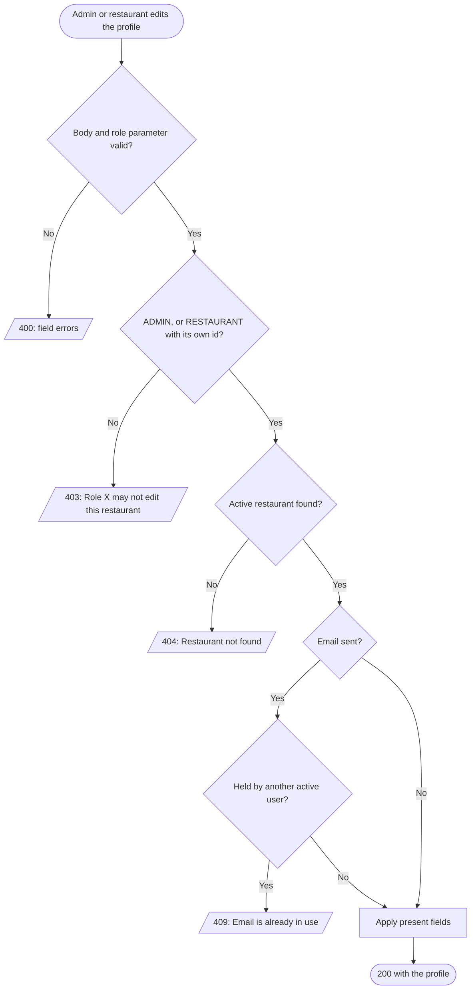
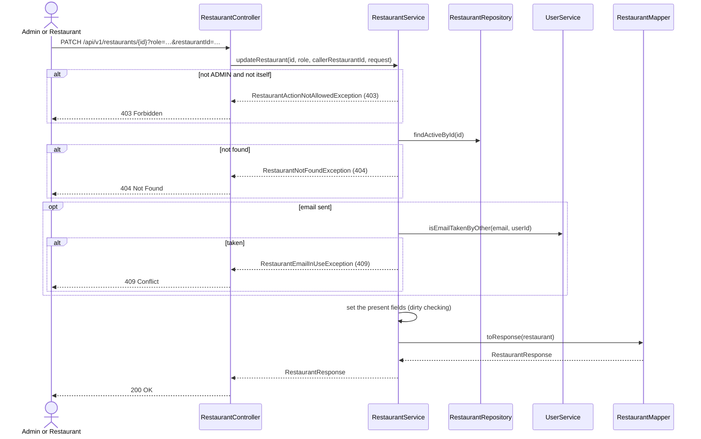

# Goal

The System Admin, or the restaurant itself, changes the restaurant's name, description or contact email.

Issue [#87](https://github.com/msmohammed0077-cmd/mentorship-restaurant/issues/87), under the
Restaurant CRUD umbrella [#85](https://github.com/msmohammed0077-cmd/mentorship-restaurant/issues/85).
Design: [restaurant CRUD](../../../designs/2026-10-10-restaurant-crud-design.md).

## Actor

System Admin (`?role=ADMIN`), or the restaurant (`?role=RESTAURANT&restaurantId={id}`).

## Preconditions

The restaurant exists and is not deleted.

## Scope

`PATCH /api/v1/restaurants/{id}?role=…[&restaurantId=…]` — **200** with the updated profile.

Adds `UpdateRestaurantRequest`, `RestaurantService.updateRestaurant` and the private guard
`ensureMayManage(restaurantId, role, callerRestaurantId, action)`, which open/close shares.

## Business Rules

1. Only **`ADMIN`**, or **`RESTAURANT`** whose `restaurantId` is the `{id}` being edited, may edit.
   Anything else — another role, another restaurant's id, or `RESTAURANT` with no `restaurantId` —
   is 403, "Role X may not edit this restaurant", **before** the database is read.
2. Every field is **optional**. An absent or `null` field is left as it is, so the description
   cannot be cleared here.
3. The **name** is written to both the restaurant and its user, as at create.
4. The **email** is trimmed and lower-cased, and must not be held by **another** active user —
   409, "Email is already in use". Re-sending the restaurant's own email, in any case, is accepted.
5. The changes are made on the loaded entities; dirty checking writes them at commit.

## Authorisation

Trust-based: the caller declares `?role=` and `?restaurantId=`, and the service believes them.
Anyone can claim `ADMIN`, or claim to be any restaurant, and edit it — an IDOR that closes with
real authentication, [#83](https://github.com/msmohammed0077-cmd/mentorship-restaurant/issues/83).

## API

```http
PATCH /api/v1/restaurants/4?role=RESTAURANT&restaurantId=4
Content-Type: application/json

{
  "name": "Koshary Palace",
  "email": "hello@kosharypalace.example.com"
}
```

| Field | Rule |
| --- | --- |
| `name` | optional; if present not blank, max 150 |
| `description` | optional |
| `email` | optional; if present not blank, valid email, max 255 |

Response, **200**:

```json
{
  "restaurant_id": 4,
  "name": "Koshary Palace",
  "description": "Koshary, the Cairo way.",
  "email": "hello@kosharypalace.example.com",
  "is_open": false
}
```

## Data Model

No migration.

| Field | Columns written |
| --- | --- |
| `name` | `restaurants.restaurant_name`, `users.user_name` |
| `description` | `restaurants.restaurant_description` |
| `email` | `users.user_email` |

## Main Success Scenario

1. The caller sends the fields to change, with its role (and, as a restaurant, its id).
2. The system validates the body (400 before the service runs).
3. The system checks the role against the restaurant being edited.
4. The system loads the active restaurant and its user.
5. If an email is sent, the system normalises it and checks no other active user holds it.
6. The system applies the present fields and returns 200 with the profile.

## Exception Flows

- **1a. `role` missing or not a role:** 400, "role is required" / "role is not a valid value".
- **2a. Body invalid:** 400, naming each failing field.
- **3a. Not `ADMIN`, and not the restaurant itself:** 403, "Role X may not edit this restaurant".
  Nothing is read or written.
- **4a. Restaurant unknown or deleted:** 404, "Restaurant not found".
- **5a. Email held by another active user:** 409, "Email is already in use". Nothing is changed.

## Postconditions

The restaurant's profile, and its user's name and email, hold the new values; the details and the
index show them.

## Diagram

### Flowchart



### Sequence Diagram



## Testing

`UpdateRestaurantEndpointTest`, end-to-end.

| Case | Expected |
| --- | --- |
| Admin sends name, description, mixed-case email | 200, email lower-cased; stored `user_name` = `restaurant_name` |
| Restaurant edits itself | 200 |
| `{"name": null}` | 200, every field unchanged |
| Its own email, upper-cased | 200 |
| Seeded restaurant's email, upper-cased | 409, email unchanged |
| Seeded customer's email | 409 |
| `CUSTOMER`, `COURIER`, `SYSTEM` | 403, nothing written |
| `RESTAURANT` with another restaurant's id / with no id | 403 |
| `CUSTOMER` on an unknown id | 403, not 404 |
| Unknown id / soft-deleted restaurant | 404 |
| No `role` | 400 |
| Blank name, name of 151, blank email, malformed email | 400 naming the field |

Every email the test creates, including the new email of an edit, starts with
`update.restaurant.test.`; cleanup deletes only those users.

# Notes

1. **Two simultaneous edits to the same email** both pass the check; the second then hits
   `uq_users_active_email` and answers 500. Create accepts the same race.
2. **Surrounding whitespace in the email is a 400, not trimmed.** `@Email` refuses it before the
   service runs.
3. **Opening and closing** is its own use-case, [set-restaurant-open](../set-restaurant-open/set-restaurant-open.md);
   an `is_open` in this body is ignored.
